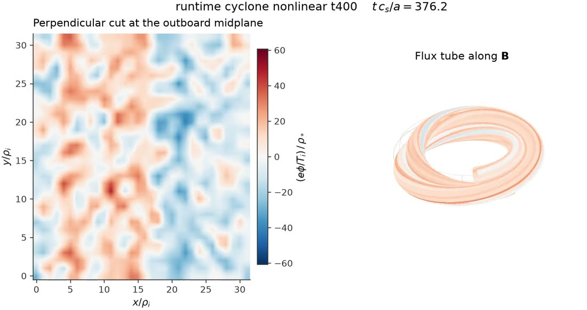

# GKX

[](https://github.com/uwplasma/GKX/releases)
[](https://pypi.org/project/gkx/)
[](https://github.com/uwplasma/GKX/actions/workflows/ci.yml)
[](https://codecov.io/gh/uwplasma/GKX)
[](LICENSE)
[](pyproject.toml)
[](https://gkx.readthedocs.io)

GKX is a **JAX-native gyrokinetic solver** for tokamaks and stellarators: linear
stability, nonlinear turbulence, and differentiable analysis that plugs straight
into stellarator optimization. It runs on CPUs and GPUs, from a one-line command
or from Python.

```bash
pip install gkx && gkx
```

[](https://github.com/uwplasma/GKX/releases/download/v1.7.0/gkx-cyclone-itg-turbulence.mp4)

**Saturated ITG turbulence on a Cyclone flux tube** (32×32×24, `t ≈ 300–376`),
shown as the perpendicular cut a gyrokineticist reads and as the field-aligned
tube in real space — the same data twice, because a flux-tube movie that only
shows the perpendicular plane hides the parallel elongation that defines the
turbulence. Amplitude is steady across all 120 frames, not growing.
**[▶ Play the movie](https://github.com/uwplasma/GKX/releases/download/v1.7.0/gkx-cyclone-itg-turbulence.mp4)** (1.8 MB), or regenerate it with
[`build_turbulence_movie.py`](tools/artifacts/build_turbulence_movie.py).

## Why GKX

| | |
| --- | --- |
| **Collisions other codes don't have** | Five operators, from Lenard-Bernstein up to the **full gyrokinetic Coulomb** with finite-Larmor-radius effects — selected with one TOML key |
| **Differentiable end to end** | JAX autodiff through geometry, solver and diagnostics, including implicit eigenvalue derivatives — real gradients for stellarator shape optimization |
| **Resolutions a dense solver can't hold** | Matrix-free eigenmodes at `n = 494,592`, where the dense operator alone would be **3.6 TiB** — with the eigenpair still differentiable |
| **Verified against exact physics** | Landau roots to 0.004%, conservation to machine precision, published Appendix-C coefficients to 1e-12 |
| **Fast where it matters** | GPU execution, restartable NetCDF output, publication figures from `gkx --plot` |

## Installation

```bash
pip install gkx
```

For development:

```bash
git clone https://github.com/uwplasma/GKX
cd GKX
pip install -e .
```

## Quickstart

Run the built-in linear initial-value example:

```bash
gkx
```

The equivalent `gkx` entry point is also installed. The default run
prints setup, progress, elapsed time, and ETA, then writes its input, summary,
time series, eigenfunction, and a two-panel plot in the current directory.

Run a checked-in case or plot an existing result:

```bash
gkx examples/linear/axisymmetric/cyclone.toml
gkx run-runtime-nonlinear \
  --config examples/nonlinear/axisymmetric/runtime_cyclone_nonlinear.toml \
  --steps 200 --out cyclone.out.nc
gkx --plot cyclone.out.nc
```

Generate the small VMEC equilibria used by the self-contained examples:

```bash
pip install vmex
cd examples/vmec
./generate_wouts.sh
```

Full documentation is hosted at **[gkx.readthedocs.io](https://gkx.readthedocs.io)**.
Start with the [quickstart](https://gkx.readthedocs.io/en/latest/quickstart.html) and
[input reference](https://gkx.readthedocs.io/en/latest/inputs.html) for linear,
nonlinear, Miller, VMEC, restart, quasilinear, and plotting workflows.

## Differentiable matrix-free eigenmodes

Design studies need a few physical modes and their derivatives, not a dense
spectrum. GKX applies the full gyrokinetic RHS inside a restarted eigensolver, so
storage is `O(n m)` rather than `O(n²)`.


The dense path is bounded by **memory, not speed** — at the largest tested
truncation (`n = 494,592`) its operator alone would be 3.6 TiB, so it cannot
represent the problem at any speed.

```python
settings = gkx.AdaptiveLinearEigensolverConfig(tolerance=1e-9, candidate_count=2)

def objective(boundary):
    values = gkx.solver_objective_vector_from_geometry(
        build_solver_geometry(boundary),
        n_laguerre=16, n_hermite=24,
        eigensolver="adaptive-propagator", adaptive_config=settings,
    )
    return values[-1]          # quasilinear transport objective

value, gradient = jax.value_and_grad(objective)(initial_shape)
```

Reverse mode uses `dλ/dp = wᴴ(dA/dp)v / (wᴴv)` plus a bordered solve for
eigenvector observables — no differentiation through the iteration. Residual,
overlap, spectral-gap and conditioning gates reject ambiguous modes.

| | Memory | Branch handling | Derivative |
| --- | ---: | --- | --- |
| Dense eigensolve | `O(n²)` | all modes at small `n` | dense eigenvector AD |
| Initial-value fit | `O(n)` | can switch at crossings | long-trajectory AD |
| **GKX** | **`O(n m)`** | **certified candidates + continuation** | **implicit JAX VJP** |

Opt-in: the default stays dense so established results are unchanged. Measured
boundaries, the sparse fallback, the physics-aware shift inverse and what is
*not* claimed are in the [eigensolver documentation](docs/differentiable_eigensolver.rst);
the inner-solver choice behind it is in [numerical defaults](docs/solvax_defaults.rst).


## Validation

Every figure below is anchored to something external — an exact root, a
published coefficient, or a tracked reference run — and regenerates from a
script in [`tools/artifacts`](tools/artifacts).

### Landau damping against the exact kinetic roots

GKX's own linear operator, extrapolated to zero collisionality, against the
roots of `1 + T_i/T_e + zeta Z(zeta) = 0` solved to double precision:

| | exact | GKX | error |
| --- | --- | --- | --- |
| `T_e/T_i = 1`, `omega` | 2.045904866 | 2.047220793 | 0.064% |
| `T_e/T_i = 1`, `gamma` | -0.851330459 | -0.849234188 | 0.246% |
| `T_e/T_i = 10`, `omega` | 3.728834801 | 3.728993838 | 0.004% |
| `T_e/T_i = 10`, `gamma` | -0.058337421 | -0.058339802 | 0.004% |


The measurement is harder than it looks, and the figure shows why: a
collisionless truncated Hermite system has a **purely real spectrum** (verified
to 3e-14), so it cannot Landau damp at all — what looks like damping is a
transient ending at recurrence. The root is not an eigenvalue either; it is a
pole reached by `nu -> 0` extrapolation.

### Linear benchmark parity


Max relative difference against tracked reference results: ETG and KAW below
0.1%, W7-X and HSX below 0.6%, Cyclone ITG 6.8%, **KBM 20%** — the KBM case is
the known outlier and is documented at its claim level rather than smoothed
over. Per-case detail: [benchmarks](docs/benchmarks.rst) and the
[verification matrix](docs/verification_matrix.rst).

## Collision Operators

GKX ships five collision models spanning the full hierarchy, selected with one
TOML key or one argument to the Python factory:

| `collision_operator` | Model | Reference |
| --- | --- | --- |
| `none` / `lenard_bernstein` | Conserving diagonal Lenard-Bernstein/Dougherty relaxation | built in |
| `sugama` | Drift-kinetic Sugama, conservative by construction | Frei, Ernst & Ricci (2022), Eqs. (C6a)-(C6f) |
| `improved_sugama` | Improved Sugama, corrected Pfirsch-Schlüter friction | Sugama et al. (2019); Frei, Ernst & Ricci (2022) |
| `coulomb` | Drift-kinetic linearized Coulomb (Landau) | Frei, Ernst & Ricci (2022), Eqs. (C9a)-(C9f) |
| `coulomb_finite_kperp` | Gyrokinetic Coulomb retaining finite `k_perp` | Frei, Ball, Hoffmann, Jorge, Ricci & Stenger (2021), Eqs. (3.47)-(3.50) |

```toml
[time]
collision_operator = "coulomb_finite_kperp"
```

The models agree in the collisionless limit and separate as collisionality
rises, with Lenard-Bernstein over-damping and finite-Larmor gyroaveraging
weakening the collisional damping relative to the drift-kinetic operator:


Reproduce with
[`examples/theory_and_demos/collision_operator_comparison.py`](examples/theory_and_demos/collision_operator_comparison.py)
(`--nu-scan` draws the figure), or run
[`examples/linear/axisymmetric/cyclone_coulomb_collisions.toml`](examples/linear/axisymmetric/cyclone_coulomb_collisions.toml)
through the executable.

### How GKX compares

GKX shares its Hermite-Laguerre gyro-moment velocity representation with GX,
which is what makes GX the closest parity reference. The differences that
matter for verification are the collision hierarchy and the differentiable
geometry path:

| | GKX | GX | GENE |
| --- | --- | --- | --- |
| Velocity space | Hermite-Laguerre moments | Hermite-Laguerre moments | grid in `(v_par, mu)` |
| Collision models | 5, through gyrokinetic Coulomb | Dougherty + hypercollisions | Landau and model operators |
| Differentiable | JAX autodiff end to end | not a design goal | not a design goal |

This records scope, not quality — both codes are mature and each is stronger
than GKX in areas GKX does not attempt. A well-converged Dougherty operator can
also be a better physical answer than an unconverged Coulomb one; see
[related codes](docs/codes.rst) for the qualifications.

### How the operators are verified

Every shipped matrix is checked against the published closed forms, not only
against itself:

| Property | Result |
| --- | --- |
| Density, parallel-momentum, energy conservation | machine precision (≤ 2.2e-16) |
| H-theorem (negative semidefinite) | holds for every model |
| Onsager self-adjointness | exact (≤ 3.4e-17) |
| Published Appendix-C coefficients | reproduce to 1e-12 |
| Finite-Larmor `b -> 0` limit | reduces to the drift-kinetic operator exactly |
| Finite-Larmor conservation defect | scales as `B^1.96`-`B^1.99`, first order in `b` |


The finite-Larmor operator acts on gyrocenter moments, whose conservation is
modified by gyroaveraging, so the *ordering* is the test: the defect must vanish
at `b = 0` and enter at first order. Coulomb tables are generated for
like-species collisions; a multispecies request is refused rather than silently
extrapolated. Equations, thresholds, convergence panels and the reproduction
recipe: [operators](docs/operators.rst).


## What GKX Solves

The gyrokinetic equation for the perturbed distribution of each species,
expanded in a **Hermite-Laguerre** velocity basis. Writing the gyrocenter
distribution as

```
delta f_s = F_Maxwellian * sum_{m,l}  G_s^{m,l}  psi_m(v_par / v_th)  L_l(mu B / T)
```

with `psi_m = H_m / sqrt(2^m m! sqrt(pi))` the normalized Hermite functions and
`L_l` the Laguerre polynomials. This turns velocity space into two spectral
indices: `m` resolves parallel dynamics (Landau damping, parallel heat flux),
`l` resolves perpendicular dynamics (FLR effects, trapping). The evolved state
is a single array

```
G[species, laguerre l, hermite m, ky, kx, z]
```

and each physical effect becomes a specific coupling on it:

| Term | What it does to `G` | Set by |
| --- | --- | --- |
| Parallel streaming | couples `m` to `m±1` (a ladder in Hermite index) | geometry `gradpar` |
| Magnetic mirror | couples `m` and `l` together | `bgrad` |
| Curvature / grad-B drift | multiplies by `i(k · v_d)` | geometry curvature |
| Diamagnetic drive | injects free energy from the gradients | `[[species]] tprim`, `fprim` |
| Collisions | couples moments within a species | `collision_operator` |
| Nonlinearity | `E × B` convolution in `(kx, ky)`, pseudo-spectral | nonlinear solver |
| Field solve | quasineutrality + parallel Ampere for `phi`, `A_par`, `B_par` | `beta`, species list |

Perpendicular directions are Fourier (`kx`, `ky`); the parallel direction `z`
follows a field line (flux tube). Electrons are kinetic or Boltzmann.

**Why a moment basis:** `m` and `l` are the same kind of index as `kx` and
`ky`, so the whole problem is dense linear algebra on one array — which is what
a GPU is good at. The cost is that the parallel ladder must be terminated
somewhere, which is what the closure section below is about.

## Geometry

| `[geometry] model` | Gives you | Needs |
| --- | --- | --- |
| `"s-alpha"` | circular tokamak, `B = B0/(1 + eps cos theta)` | `q`, `s_hat`, `epsilon`, `R0` |
| `"slab"` | uniform field, sharpest numerics tests | grid only |
| `"imported-eik"` / `"vmec-eik"` | Miller or full 3D stellarator from a file | `geometry_file` |

Miller equilibria and VMEC/Boozer flux tubes are also built in-process through
the Python API, where the metric coefficients stay differentiable — that is the
path stellarator shape optimization uses.

## Configuration

One TOML file. Every key has a default, so a working input is short — the
sections you actually touch most days are the first five.

| Section | Controls | Common keys |
| --- | --- | --- |
| `[[species]]` | one block per species | `charge`, `mass`, `temperature`, `tprim`, `fprim`, `nu`, `kinetic` |
| `[grid]` | resolution and box | `Nx`, `Ny`, `Nz`, `Lx`, `Ly`, `boundary` |
| `[geometry]` | equilibrium | `model`, `q`, `s_hat`, `epsilon`, `R0`, `geometry_file` |
| `[time]` | integration | `t_max`, `dt`, `method`, `collision_operator` |
| `[physics]` | what to include | `linear`, `nonlinear`, `electrostatic`, `adiabatic_electrons`, `tau_e` |
| `[init]` | initial condition | `init_field`, `init_amp`, `gaussian_width` |
| `[collisions]` | collision and hypercollision rates | `nu_hermite`, `nu_laguerre`, `nu_hyper`, `p_hyper` |
| `[terms]` | switch individual terms on/off (0/1) | `streaming`, `mirror`, `curvature`, `diamagnetic`, `nonlinear` |
| `[run]`, `[scan]` | single run / `k_y` scan resolution | `ky`, `Nl`, `Nm`, `solver` |
| `[normalization]` | benchmark normalization contract | `contract`, `diagnostic_norm` |
| `[fit]` | growth-rate fit window | `auto_window`, `window_method` |

`[terms]` is the debugging lever: setting one coefficient to `0.0` removes
exactly that term, which is how most of the physics gates isolate what they
test.

Full key-by-key reference:
[inputs](https://gkx.readthedocs.io/en/latest/inputs.html).

## Runtime and Memory


Cold wall time and peak memory across the tracked cases. Cold times include JAX
startup and compilation, which is the right number for "how long does a run
take" and the wrong one for kernel speed.

GKX CPU→GPU speedup spans **0.7× to 13.1×** depending on the case — the small
linear cases are dominated by startup, so the GPU can be slower. Warm timings
and profiler artifacts: [performance](docs/performance.rst).

## Differentiable Python API

```python
import jax.numpy as jnp

from gkx import CycloneBaseCase, LinearParams, integrate_linear_from_config
from gkx.core.grid import build_spectral_grid
from gkx.geometry import SAlphaGeometry

cfg = CycloneBaseCase()
grid = build_spectral_grid(cfg.grid)
geometry = SAlphaGeometry.from_config(cfg.geometry)
parameters = LinearParams()
state = jnp.zeros((2, 2, grid.ky.size, grid.kx.size, grid.z.size), dtype=jnp.complex64)
state = state.at[0, 0, 0, 0, :].set(1.0e-3)
trajectory, potential = integrate_linear_from_config(
    state, grid, geometry, parameters, cfg.time
)
```

For repeated nonlinear calls with fixed geometry and numerical policy, prepare
the compiled simulation once:

```python
from gkx.solvers.nonlinear.diagnostic_integration import prepare_nonlinear_explicit_diagnostics

simulation = prepare_nonlinear_explicit_diagnostics(
    initial_state,
    grid,
    geometry,
    parameters,
    dt=0.02,
    steps=400,
    resolved_diagnostics=False,
)
time, diagnostics, final_state, fields = simulation.run()
```

The prepared object accepts another same-shape initial state without rebuilding
the scan. A matched rebuilt cache/parameter PyTree can also remain dynamic for
autodiff; geometry layout is fixed, and dynamic-geometry compile reuse remains
an active differentiability lane.

The planted two-mode inverse problem below recovers two gradient parameters and
checks the autodiff Jacobian against finite differences. The single-mode demo in
the docs intentionally demonstrates non-identifiability rather than exact
parameter recovery.


See [differentiable geometry](docs/geometry.rst),
[algorithms](docs/algorithms.rst), and [stellarator optimization](docs/stellarator_optimization.rst)
for JVP, VJP, implicit differentiation, conditioning, covariance, and finite-difference gates.

## Velocity resolution and recurrence

Truncating the Hermite ladder at `m = M` makes the end of it a **reflecting
wall**: free energy streams up in `m`, hits the wall, and returns as
*recurrence* at

```
t_rec ~ 2 sqrt(M) / (k_par v_th)
```

Nothing after `t_rec` is physics, and because `t_rec` grows only as `sqrt(M)`,
adding moments is a weak fix — the ladder has to absorb instead. Measured on the
free-streaming hierarchy, a hard truncation returns **99.9% of the initial
amplitude** (it dissipates nothing), while hypercollisions cut that to 0.0002.

Hypercollisions are the default and are what you want. GKX also ships an opt-in
**reflectionless closure** (Kanekar et al., JPP **81**, 305810104 (2015)) whose
coefficient tends to 1 with resolution, so it needs no tuning and touches only
`m = M`; on measurement it does not beat a well-tuned hypercollision.

Full derivation, both metrics, resolution scans and the closure coefficient:
[numerics](docs/numerics.rst).

## Quasilinear Modeling


**Use it for:** ranking and correlation studies, optimization screening.
**Not for:** absolute heat flux — it is not a runtime/TOML absolute-flux
predictor. Absolute-flux promotion stays rejected while the declared Solovev and
shaped-pressure stress outliers are retained.

Derivations, calibration splits, uncertainty and holdout gates:
[quasilinear docs](docs/quasilinear.rst).

## QA ITG Optimization

Objective = aspect ratio + mean iota + quasisymmetry, plus one GKX residual
(growth rate, quasilinear, or nonlinear window). Baseline is the max-mode-5 QA
workflow; all transport comparisons use solved VMEC equilibria.

### Turbulence has to be weighted to be optimized

At the shipped weight the transport term was **0.00% of the objective** — iota
94.4%, aspect 5.4%, quasisymmetry 0.2%. The optimizer never saw it. Weighting
the seed-normalized transport residual properly buys a large flux reduction for
a modest quasisymmetry cost:

| transport weight | quasisymmetry / seed | quasilinear flux / seed |
| --- | --- | --- |
| 0.01 (old default) | 0.14 | 0.38 |
| 0.5 | 0.24 | 0.29 |
| **2.0** (current default) | 0.67 | **0.07** |
| 8.0 | — | solver stalls |


`TRANSPORT_WEIGHT = 2.0` cuts the quasilinear proxy by **93%** while
quasisymmetry stays 33% better than the seed. Above ~4 the least-squares solver
stalls on the finite-difference gradient of the proxy — raise it only with an
analytic Jacobian. Regenerate with
[`build_qa_transport_weight_scan.py`](tools/artifacts/build_qa_transport_weight_scan.py).

**This is the quasilinear proxy, not a transport prediction.** A 0.07x proxy is
evidence the objective now drives the design it is supposed to drive; it is not
evidence of nonlinear flux reduction, which requires the audits below.

### Nonlinear flux reduction is not demonstrated

The weight scan above fixes the *objective*, not the physics claim. Matched
long post-transient nonlinear audits of the reweighted designs have not been
run. The earlier audits, which used converged post-transient heat-flux windows,
predate the reweighting and showed no statistically significant transport
reduction against the strict QA baseline.

Two measurements say why that evidence is not close. The production gradient
gate is blocked at `gradient_uncertainty_rel = 1.806` against a 0.5 maximum,
and the heat-flux windows behind it hold only 2.6-11.8 statistically
independent samples, so their error bars are understated 2.0-3.7x. Closing that
by longer averaging alone costs more than 13x the sampling. See the
[nonlinear gradient plan](docs/nonlinear_gradient_plan.rst).

Scripts: [examples/optimization](examples/optimization). Objective equations,
optimizer policies and the audit record:
[optimization docs](docs/stellarator_optimization.rst).


## Parallelization

| Status | Covers |
| --- | --- |
| Production | independent `k_y` scans, quasilinear/UQ ensembles, file-backed tasks — deterministic ordering, serial-identity gated |
| Needs a scaling artifact | sensitivity sweeps |
| Diagnostic only | nonlinear whole-state and domain decomposition |

Sensitivity sweeps can use the same deterministic independent-work
reconstruction, but they need a dedicated matched scaling artifact before any
speedup claim is promoted. Nonlinear speedup is not claimed until species-first
and Hermite-second decomposition, Hermite halo exchange, field-moment
collectives, and transport-window identity all pass.

Details: [parallelization](docs/parallelization.rst).

## Current Claim Scope

Validated release claims are bounded by the [release scope](docs/release_scope.rst):

- Standard electrostatic/electromagnetic full gyrokinetics is validated only on
  the promoted cases and observables in the verification matrix.
- Quasilinear outputs are diagnostics and screening models, not universal
  absolute nonlinear heat-flux predictions.
- Nonlinear optimization evidence requires matched, replicated, long
  post-transient windows; startup or reduced envelopes are not production evidence.
- W7-X zonal long-window recurrence/damping and W7-X TEM / kinetic-electron extensions are deferred.
- The Sugama, improved-Sugama, and Coulomb operators are verified against their
  published closed forms and structural invariants, and are validated for
  like-species collisions; species-coupled Coulomb coefficients remain open.
- Collision operators run on the fixed-step cached integrator. The diffrax,
  sharded, and Krylov eigenvalue paths reject them rather than silently
  substituting the built-in diagonal term.
- Production nonlinear domain decomposition and equilibrium ExB flow shear
  remain open.

## Full feature list

- Electrostatic and electromagnetic gyrokinetics with kinetic or Boltzmann species.
- Linear initial-value, dominant-eigenmode, and nonlinear turbulence solvers.
- Matrix-free eigenmodes with certified residuals, branch continuation, and
  implicit derivatives — `O(n m)` storage instead of `O(n²)`.
- Analytic s-alpha, Miller, imported VMEC, and differentiable VMEC/Boozer geometry.
- JAX JIT, forward/reverse autodiff, implicit eigenvalue derivatives, and UQ tools.
- Quasilinear transport diagnostics with explicit saturation-rule metadata.
- CPU/GPU execution and production parallelization for independent scans and ensembles.
- Restartable NetCDF output and `gkx --plot` publication-style figures.
- Five selectable collision operators, from a conserving Lenard-Bernstein model
  to the full linearized Coulomb (Landau) operator with finite-Larmor-radius
  effects.

## Examples and Documentation

The repository keeps small runnable examples under:

- [`examples/linear`](examples/linear): axisymmetric and stellarator linear runs.
- [`examples/nonlinear`](examples/nonlinear): nonlinear turbulence and restarts.
- [`examples/optimization`](examples/optimization): differentiable QA workflows.
- [`examples/theory_and_demos`](examples/theory_and_demos): numerical and autodiff demonstrations.
- [`benchmarks`](benchmarks): comparison inputs, drivers, and compact result indexes.

Detailed user and developer documentation:

- [Physics and equations](docs/theory.rst)
- [Operators and models](docs/operators.rst)
- [Numerics and solvers](docs/numerics.rst)
- [Matrix-free eigenmodes](docs/differentiable_eigensolver.rst) and the
  [numerical defaults](docs/solvax_defaults.rst) behind them
- [Geometry](docs/geometry.rst)
- [Outputs and plotting](docs/outputs.rst)
- [Testing and validation](docs/testing.rst)
- [Code structure](docs/code_structure.rst)
- [Release and research scope](docs/release_scope.rst)

## Testing

```bash
pytest
python tools/release/run_test_gates.py fast
python tools/release/run_test_gates.py wide-coverage \
  --shards 48 --timeout 300 --fail-under 95 \
  --pytest-arg=-o --pytest-arg=addopts= --pytest-arg=-m --pytest-arg="not slow"
python -m sphinx -W -b html docs docs/_build/html
```

The package-wide CI coverage gate is at least 95%. Physics, convergence,
comparison, differentiability, and performance gates are required in addition
to line coverage.

## License

GKX is distributed under the [MIT License](LICENSE).
