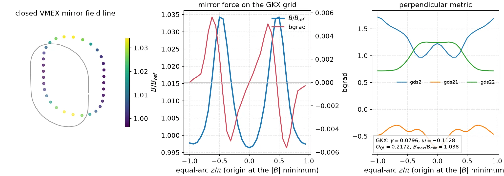

# GKX

[](https://github.com/uwplasma/GKX/releases)
[](https://pypi.org/project/gkx/)
[](https://github.com/uwplasma/GKX/actions/workflows/ci.yml)
[](https://codecov.io/gh/uwplasma/GKX)
[](LICENSE)
[](pyproject.toml)
[](https://gkx.readthedocs.io)

GKX is a JAX-native gyrokinetic solver for tokamak and stellarator flux tubes: it takes a VMEC equilibrium or an analytic geometry, computes linear stability and nonlinear turbulence in a Hermite-Laguerre velocity basis, and differentiates the whole path end to end on CPUs and GPUs.


**Saturated ITG turbulence on a Cyclone flux tube**, shown as the perpendicular
cut a gyrokineticist reads and as the field-aligned tube in real space — the
same data twice, because a flux-tube movie that only shows the perpendicular
plane hides the parallel elongation that defines the turbulence. Amplitude is
steady across the loop, not growing. It is an animated image rather than a
`<video>`, which GitHub strips from Markdown: 24 frames of WebP, 225 kB. The
**[full-rate movie](https://github.com/uwplasma/GKX/releases/download/v1.7.0/gkx-cyclone-itg-turbulence.mp4)**
(1.8 MB) is a release asset rather than tracked media; both are rebuilt by
[`build_turbulence_movie.py`](tools/artifacts/build_turbulence_movie.py).

### Closed VMEX mirror geometry



The same in-memory VMEX mirror state now feeds GKX without a file round trip:
VMEX owns field-line closure, the Clebsch/metric/drift construction, and the
equal-arc grid; GKX validates that array contract and evaluates its existing
linear and quasilinear objectives. The pictured case has mirror ratio 1.778,
growth rate 0.1391, and mixing-length heat-flux proxy 0.9979 on the documented
small resolution. See the **[rotating field-line movie](docs/_static/vmex_mirror_gkx_rotation.mp4)**,
the [model and equations](docs/geometry.rst#closed-vmex-mirror-geometry), and
the [machine-readable run record](docs/_static/vmex_mirror_gkx_showcase.json).
This is a closed periodic stellarator--mirror hybrid, not an open-end loss or
sheath calculation.

## Install

```bash
pip install gkx
gkx --help
gkx
```

`gkx` with no arguments runs a self-contained linear Cyclone demo — no input
file, no data download. It takes about 20 s on a laptop CPU, prints the fitted
`gamma` and `omega`, and writes
`gkx_default_linear.{toml,summary.json,timeseries.csv,eigenfunction.csv,png}` in
the current directory. It is deliberately short and says so: it emits a CFL
warning and an under-resolution warning rather than presenting an
under-converged growth rate as a result.

Python 3.11+ is required. The wheel pulls in CPU JAX, SciPy, matplotlib,
NetCDF4, diffrax, equinox, `solvax`, and the `booz_xform_jax` bridge used by the
VMEC geometry path; install an accelerator-enabled JAX wheel separately from the
[JAX installation guide](https://docs.jax.dev/en/latest/installation.html).

For a development checkout:

```bash
git clone https://github.com/uwplasma/GKX
cd GKX
pip install -e ".[dev]"
```

## Run an equilibrium

Point the executable at a VMEC or [VMEX](https://github.com/uwplasma/vmex)
`wout` file and you get a nonlinear ITG run, its figures, a restartable NetCDF
bundle, and the resolved input deck that reproduces it — without writing a TOML
first.

### Size the grid before you pay for it

`--estimate` reads the equilibrium, derives a minimum grid from its geometry,
prints the reasoning for every entry, and exits without running:

```bash
gkx wout_circular_tokamak.nc --estimate
```

```
equilibrium: /path/to/wout_circular_tokamak.nc
geometry: shat=+1.7190 q=2.066 nfp=1 |B| wells=1 anisotropy=0.214 -> ky_max*rho >= 2.2
    nx = 96       square perpendicular box (Lx = Ly), so Nx tracks Ny
    ny = 96       tokamak class (nfp = 1, anisotropy 0.214) asks ky_max*rho >= 2.2 (standard); reach ((Ny-1)//3)*dky = 2.21 at dky = 0.071
    nz = 48       scan found Nz weakly coupled (flux 8.47/8.78/8.39 at 24/32/48); floors: 16/2pi-period x 1, 6 x 1 |B| wells
    nl = 4        Laguerre FLR floor with hypercollisions; the scan converged at Nl=4
    nm = 8        hypercollisions: t_quiet ~ 5.5*sqrt(Nm) recurrence sets the published floor (4,8)
    dt = 0.0071   explicit CFL bound cfl_fac*cfl/sum(omega_max) at this grid; the adaptive stepper raises it toward the measured ExB limit
 t_max = 400      8 x t_sat ~ 50 hard cap; run_to = "saturation" stops earlier
```

`--estimate=cautious` and `--estimate=standard` select the target-error tier.
This is a starting point from a calibration ladder, not a convergence proof: the
tokamak rungs saturated with `64^2` about 8% above the converged `96/128` flux,
while the stellarator ladder was still falling at `128^2`, so stellarator
numbers are an upper estimate. Matched `Nx`/`Ny` convergence is still yours.

### Run it

```bash
gkx wout_circular_tokamak.nc
```

```
tokamak equilibrium (nfp = 1): preview grid 64x64 (measured ~+8% vs the converged 96/128 flux; run with --estimate for the standard/cautious tiers)
equilibrium: /path/to/wout_circular_tokamak.nc
default deck: /path/to/gkx/data/common_input.toml (copy, edit, then: gkx my_input.toml wout_circular_tokamak.nc)
wrote resolved input: /path/to/wout_circular_tokamak/gkx.toml
config=.../wout_circular_tokamak/gkx.toml ky=0.0714 Nl=4 Nm=8 method=rk3 dt=0.1 steps=auto
grid=Nx64 Ny64 Nz48 diagnostics=on progress=off
physics=electrostatic kinetic=ion(a/L_T=3,a/L_n=1) adiabatic=electrons
runtime: CFL margin: dt=0.1 bound=0.02337 ratio=4.28x (streaming 32% of the bound)
runtime: run_to=saturation: heat-flux convergence with stationary Wphi/Wg (rel_sem<=0.05)
runtime: starting adaptive nonlinear integration in chunks of 128 steps up to t_max=200
runtime: completed nonlinear chunk 1: t=2.99115/200 progress=  1.5% chunk_wall=02:18 elapsed=02:18 eta=2:31:57
```

(Transcript abridged; the per-chunk ETA is whatever the host can sustain, and
the cost figures below are the measured reference.) The header names the deck
the defaults came from, because the resolved copy alone does not tell a
first-time user what to edit. Copy that deck, change it, and run
`gkx my_input.toml wout_circular_tokamak.nc`; your deck is then used verbatim
and no class-based grid preview is applied.

A completed run groups everything under `./<wout-stem>/`:

| Artifact | Contents |
| --- | --- |
| `gkx.toml` | the fully resolved deck that reproduces this run |
| `gkx.summary.json` | fitted scalars, saturation verdict, and the averaging window |
| `gkx.out.nc` | diagnostic history, geometry, spectra, and input metadata |
| `gkx.big.nc` | final spectral and real-space fields and moments |
| `gkx.restart.nc` | packed Hermite-Laguerre state for continuation |
| `gkx.{flux_time,flux_spectra,phi2_spectra,snapshot_xy,flux_tube_3d,summary}.png` | the standard figure set |

A run that was too small says so rather than presenting the number anyway. The
lines below are from a deliberately under-resolved `16x16x16`, `t_max = 6` run
of the same equilibrium, and appear both in the run log and again on replot:

```
warning: heat-flux ky cutoff is unresolved: the highest 10% of retained positive-ky modes reach 100% of the spectral peak (warning threshold 10%). Increase Ny at fixed Ly, then repeat matched Nx/Ny convergence; this warning is necessary, not sufficient, for resolution.
saturation: not saturated by the time horizon window=[3.06144,6] heat_flux=3.15837e-06+/-3.70499e-07 rel_sem=0.117307 tau_ac=0.521488
```

Replot any saved bundle without rerunning the physics:

```bash
gkx plot wout_circular_tokamak/gkx.out.nc
```

**What it costs.** Measured on an Apple M3 Max (10 performance + 4 efficiency
cores, JAX CPU, float32) with the shipped default deck at `96x96x48`, a full
`t_max = 200` run takes roughly 1.0–1.6 hours, about 97 per cent of it time
stepping. Cost is linear in degrees of freedom at 72–80 ns per `Nx*Ny*Nz*Nl*Nm`
element per step across every grid measured, so a 4-core laptop extrapolates to
several hours. Within one step, about 59 per cent is data movement, 31 per cent
FFTs, and under 10 per cent physics arithmetic — reducing that movement is the
largest available lever and is on the roadmap. Geometry, compilation, plotting,
and I/O are seconds each. Method and per-case numbers:
[performance](docs/performance.rst).

### Stop when the answer stops changing

The cheapest way to make a nonlinear run faster is not to integrate past the
point where the answer has stopped changing. Diagnosed nonlinear runs therefore
stop at saturation by default (`[time] run_to = "saturation"`). GKX integrates
in chunks and, after each one, measures the heat-flux trace with the spin-up
phase excluded: it stops when the autocorrelation-corrected relative SEM of the
windowed mean falls to `saturation_rel_sem` (default `0.05`), the window is long
enough (`saturation_min_window`, ten integrated autocorrelation times when
unset), and the two halves of the window agree within twice their combined SEM.
`t_max` stays the hard cap, so nothing is lost if the run never saturates, and
the summary reports the window it averaged over together with `mean ± SEM`.
Set `run_to = "t_max"` or pass `--no-until-saturated` for a fixed horizon.
Defaults and gates: [`src/gkx/diagnostics/saturation.py`](src/gkx/diagnostics/saturation.py)
and [inputs](https://gkx.readthedocs.io/en/latest/inputs.html).

### Generate the example equilibria

The self-contained VMEC examples need small `wout` files, built with VMEX:

```bash
pip install vmex
cd examples/vmec
./generate_wouts.sh
```

## Run a checked-in case

Every shipped example is a runtime TOML the executable accepts directly:

```bash
gkx examples/linear/axisymmetric/cyclone.toml
gkx run-runtime-nonlinear \
  --config examples/nonlinear/axisymmetric/runtime_cyclone_nonlinear.toml \
  --steps 200 --out cyclone.out.nc
gkx plot cyclone.out.nc
```

The first command runs the Cyclone linear point through the certified Krylov
path and prints the converged eigenvalue and its residual:

```
runtime: adaptive solve finished with eig=0.0930891-0.282015j residual=6.08e-05 converged=True stable=True
ky=0.3000 gamma=0.093089 omega=0.282015
```

A deck without an `[output] path` and without `--out` writes no files; add
either to keep artifacts. `gkx run` auto-detects linear versus nonlinear from
`[physics]`; `gkx --help` lists the explicit `run-runtime-linear`,
`scan` (legacy: `scan-runtime-linear`), `run-runtime-nonlinear`, and `geometry` subcommands.

Examples live under [`examples/linear`](examples/linear) (axisymmetric and
stellarator linear runs), [`examples/nonlinear`](examples/nonlinear)
(turbulence and restarts), [`examples/optimization`](examples/optimization)
(differentiable QA workflows),
[`examples/theory_and_demos`](examples/theory_and_demos) (numerical and autodiff
demonstrations), and [`benchmarks`](benchmarks) (comparison inputs, drivers, and
compact result indexes).

## Configure a run

One TOML file. Every key has a default, so a working input is short — the
sections you touch most days are the first five.

| Section | Controls | Common keys |
| --- | --- | --- |
| `[[species]]` | one block per species | `charge`, `mass`, `temperature`, `tprim`, `fprim`, `nu`, `kinetic` |
| `[grid]` | resolution and box | `Nx`, `Ny`, `Nz`, `Lx`, `Ly`, `boundary` |
| `[geometry]` | equilibrium | `model`, `q`, `s_hat`, `epsilon`, `R0`, `geometry_file` |
| `[time]` | integration | `t_max`, `dt`, `method`, `run_to`, `collision_operator` |
| `[physics]` | what to include | `linear`, `nonlinear`, `electrostatic`, `adiabatic_electrons`, `tau_e` |
| `[init]` | initial condition | `init_field`, `init_amp`, `gaussian_width` |
| `[collisions]` | collision and hypercollision rates | `nu_hermite`, `nu_laguerre`, `nu_hyper`, `p_hyper` |
| `[terms]` | switch individual terms on/off (0/1) | `streaming`, `mirror`, `curvature`, `diamagnetic`, `nonlinear` |
| `[run]`, `[scan]` | single run / `k_y` scan resolution | `ky`, `Nl`, `Nm`, `solver` |
| `[normalization]` | benchmark normalization contract | `contract`, `diagnostic_norm` |
| `[fit]` | growth-rate fit window | `auto_window`, `window_method` |

`[terms]` is the debugging lever: setting one coefficient to `0.0` removes
exactly that term, which is how most of the physics gates isolate what they
test. The shipped default deck is
[`examples/common_input.toml`](examples/common_input.toml); the key-by-key
reference is [inputs](https://gkx.readthedocs.io/en/latest/inputs.html).

### Geometry

| `[geometry] model` | Gives you | Needs |
| --- | --- | --- |
| `"s-alpha"` | circular tokamak, `B = B0/(1 + eps cos theta)` | `q`, `s_hat`, `epsilon`, `R0` |
| `"slab"` | uniform field, sharpest numerics tests | grid only |
| `"imported-eik"` / `"vmec-eik"` | Miller or full 3D stellarator from a file | `geometry_file` |

Miller equilibria and VMEC/Boozer flux tubes are also built in-process through
the Python API, where the metric coefficients stay differentiable — that is the
path stellarator shape optimization uses. See
[differentiable geometry](docs/geometry.rst).

## What GKX solves

The gyrokinetic equation for the perturbed distribution of each species,
expanded in a **Hermite-Laguerre** velocity basis. Writing the gyrocenter
distribution as

```
delta f_s = F_Maxwellian * sum_{m,l}  G_s^{m,l}  psi_m(v_par / v_th)  L_l(mu B / T)
```

with `psi_m = H_m / sqrt(2^m m! sqrt(pi))` the normalized Hermite functions and
`L_l` the Laguerre polynomials. This turns velocity space into two spectral
indices: `m` resolves parallel dynamics (Landau damping, parallel heat flux),
`l` resolves perpendicular dynamics (FLR effects, trapping). The evolved state
is a single array

```
G[species, laguerre l, hermite m, ky, kx, z]
```

and each physical effect becomes a specific coupling on it:

| Term | What it does to `G` | Set by |
| --- | --- | --- |
| Parallel streaming | couples `m` to `m±1` (a ladder in Hermite index) | geometry `gradpar` |
| Magnetic mirror | couples `m` and `l` together | `bgrad` |
| Curvature / grad-B drift | multiplies by `i(k · v_d)` | geometry curvature |
| Diamagnetic drive | injects free energy from the gradients | `[[species]] tprim`, `fprim` |
| Collisions | couples moments within a species | `collision_operator` |
| Nonlinearity | `E × B` convolution in `(kx, ky)`, pseudo-spectral | nonlinear solver |
| Field solve | quasineutrality + parallel Ampere for `phi`, `A_par`, `B_par` | `beta`, species list |

Perpendicular directions are Fourier (`kx`, `ky`); the parallel direction `z`
follows a field line (flux tube). Electrons are kinetic or Boltzmann.

**Why a moment basis:** `m` and `l` are the same kind of index as `kx` and
`ky`, so the whole problem is dense linear algebra on one array — which is what
a GPU is good at. The cost is that the parallel ladder must be terminated
somewhere, which is what the next section is about. Full derivation:
[theory](docs/theory.rst) and [numerics](docs/numerics.rst).

## Velocity resolution and recurrence

Truncating the Hermite ladder at `m = M` makes the end of it a **reflecting
wall**: free energy streams up in `m`, hits the wall, and returns as
*recurrence* at

```
t_rec ~ 2 sqrt(M) / (k_par v_th)
```

Nothing after `t_rec` is physics, and because `t_rec` grows only as `sqrt(M)`,
adding moments is a weak fix — the ladder has to absorb instead. Measured on the
free-streaming hierarchy at `k_par v_ti = 1` from `|g_0| = 1`, a hard truncation
returns 0.9987 (`M = 16`) to 0.9998 (`M = 128`) of the initial amplitude: it
dissipates nothing, and free streaming is anti-Hermitian, so that is as complete
as the norm bound allows. Hypercollisions at the GX Appendix-B normalization cut
the revival to 0.0009 at `M = 16` and 0.0002 at `M = 64`, at a resolved-window
error of 8.5e-4 and 2.0e-4.

Hypercollisions are the default. GKX also ships an opt-in **reflectionless
closure** (Kanekar et al., JPP **81**, 305810104 (2015)) whose coefficient tends
to `1 - 1/(4M)` with resolution, so it needs no tuning and touches only `m = M`;
on these measurements it does not beat a well-tuned hypercollision (0.0194
revival at `M = 64`). Its merits are structural: no free parameter, and no way
to bias resolved moments. Both metrics are quoted because revival suppression
alone rewards *any* strong damping, while the resolved-window error charges for
perturbing physics that is still resolved, against a converged `M = 1024` run.
Full table and resolution scans: [numerics](docs/numerics.rst).

## Collision operators

GKX ships five collision models spanning the full hierarchy, selected with one
TOML key or one argument to the Python factory:

| `collision_operator` | Model | Reference |
| --- | --- | --- |
| `none` / `lenard_bernstein` | Conserving diagonal Lenard-Bernstein/Dougherty relaxation | built in |
| `sugama` | Drift-kinetic Sugama, conservative by construction | Frei, Ernst & Ricci (2022), Eqs. (C6a)-(C6f) |
| `improved_sugama` | Improved Sugama, corrected Pfirsch-Schlüter friction | Sugama et al. (2019); Frei, Ernst & Ricci (2022) |
| `coulomb` | Drift-kinetic linearized Coulomb (Landau) | Frei, Ernst & Ricci (2022), Eqs. (C9a)-(C9f) |
| `coulomb_finite_kperp` | Gyrokinetic Coulomb retaining finite `k_perp` | Frei, Ball, Hoffmann, Jorge, Ricci & Stenger (2021), Eqs. (3.47)-(3.50) |

```toml
[time]
collision_operator = "coulomb_finite_kperp"
```

The models agree in the collisionless limit and separate as collisionality
rises, with Lenard-Bernstein over-damping and finite-Larmor gyroaveraging
weakening the collisional damping relative to the drift-kinetic operator:


Run
[`cyclone_coulomb_collisions.toml`](examples/linear/axisymmetric/cyclone_coulomb_collisions.toml)
through the executable to try one.

### How the operators are verified

Every shipped matrix is checked against the published closed forms, not only
against itself. The numbers below are the tracked metrics in
[`docs/_static/collision_operator_verification.json`](docs/_static/collision_operator_verification.json),
each beside the gate it must clear:

| Property | Measured | Gate |
| --- | --- | --- |
| Density, parallel-momentum, energy conservation | 5.6e-17 | 5e-12 |
| Onsager self-adjointness | 8.3e-17 | 5e-12 |
| Published Appendix-C coefficients | 1.1e-16 | 5e-12 |
| Moment-projection relative error | 3.1e-13 | 5e-9 |
| H-theorem (negative semidefinite) | max eigenvalue 9.0e-18 | 1e-12 |
| Finite-Larmor conservation defect order in `b` | 1.94, 1.98, 2.00 | 1.7–2.3 |


The finite-Larmor operator acts on gyrocenter moments, whose conservation is
modified by gyroaveraging, so the *ordering* is the test: the defect must vanish
at `b = 0` and enter at first order, which is what the three observed diffusion
orders measure. The `b -> 0` limit reduces to the drift-kinetic operator
exactly. Coulomb tables are generated for like-species collisions; a
multispecies request is refused rather than silently extrapolated. Equations
and convergence panels: [operators](docs/operators.rst).

## Validate against exact physics

Every figure here is anchored to something external — an exact root, a
published coefficient, or a tracked reference run — and regenerates from a
script listed under [Reproducing the figures](#reproducing-the-figures).

### Landau damping against the exact kinetic roots

GKX's own linear operator, extrapolated to zero collisionality, against the
roots of `1 + T_i/T_e + zeta Z(zeta) = 0` solved to double precision:

| | exact | GKX | error |
| --- | --- | --- | --- |
| `T_e/T_i = 1`, `omega` | 2.045904866 | 2.047220793 | 0.064% |
| `T_e/T_i = 1`, `gamma` | -0.851330459 | -0.849234188 | 0.246% |
| `T_e/T_i = 10`, `omega` | 3.728834801 | 3.728993838 | 0.004% |
| `T_e/T_i = 10`, `gamma` | -0.058337421 | -0.058339802 | 0.004% |


The measurement is harder than it looks, and the figure shows why: a
collisionless truncated Hermite system has a **purely real spectrum** (measured
2.8e-14, gated below 1e-11), so it cannot Landau damp at all — what looks like
damping is a transient ending at recurrence. The root is not an eigenvalue
either; it is a pole reached by `nu -> 0` extrapolation. Table and derivation:
[numerics](docs/numerics.rst); the gate is
[`test_landau_damping.py`](tests/validation/physics_gates/test_landau_damping.py).

### Linear benchmark parity


Maximum relative difference in growth rate against the tracked reference results
listed in [`tools/benchmark_atlas_manifest.toml`](tools/benchmark_atlas_manifest.toml),
computed as `100 * max|GKX - ref| / max|ref|` over each scan:

| Case | `gamma` | `omega` |
| --- | ---: | ---: |
| KAW | 0.0004% | 0.051% |
| ETG | 0.040% | 0.074% |
| W7-X | 0.265% | 0.296% |
| HSX | 0.577% | 0.273% |
| Cyclone Miller | 5.51% | 1.25% |
| Cyclone ITG | 6.83% | 1.59% |
| **KBM** | **20.0%** | **11.1%** |

KBM is the known outlier and is published at its claim level rather than
smoothed over. This is agreement against the tracked reference scans named in
that manifest — it is not a claim of identical physics options, resolution
policy, or feature coverage in the reference codes. Per-case detail:
[benchmarks](docs/benchmarks.rst) and the
[verification matrix](docs/verification_matrix.rst).

## Differentiate the solver

### Matrix-free eigenmodes

Design studies need a few physical modes and their derivatives, not a dense
spectrum. GKX applies the full gyrokinetic RHS inside a restarted eigensolver,
so storage is `O(n m)` rather than `O(n²)`.


The dense path is bounded by **memory, not speed**: at the largest tested
truncation, `n = 494,592`, a complex128 operator alone would be 3.6 TiB
(`16 * n² / 2^40`), so it cannot represent the problem at any speed. The
matrix-free solve at that size took 1,504 s.

```python
settings = gkx.AdaptiveLinearEigensolverConfig(tolerance=1e-9, candidate_count=2)

def objective(boundary):
    values = gkx.solver_objective_vector_from_geometry(
        build_solver_geometry(boundary),
        n_laguerre=16, n_hermite=24,
        eigensolver="adaptive-propagator", adaptive_config=settings,
    )
    return values[-1]          # quasilinear transport objective

value, gradient = jax.value_and_grad(objective)(initial_shape)
```

Reverse mode uses `dλ/dp = wᴴ(dA/dp)v / (wᴴv)` plus a bordered solve for
eigenvector observables — no differentiation through the iteration. Residual,
overlap, spectral-gap and conditioning gates reject ambiguous modes.

| | Memory | Branch handling | Derivative |
| --- | ---: | --- | --- |
| Dense eigensolve | `O(n²)` | all modes at small `n` | dense eigenvector AD |
| Initial-value fit | `O(n)` | can switch at crossings | long-trajectory AD |
| **GKX** | **`O(n m)`** | **certified candidates + continuation** | **implicit JAX VJP** |

Opt-in: the default stays dense so established results are unchanged. Measured
boundaries, the sparse fallback, the physics-aware shift inverse and what is
*not* claimed are in the [eigensolver documentation](docs/differentiable_eigensolver.rst);
the inner-solver choice behind it is in [numerical defaults](docs/solvax_defaults.rst).

### From Python

```python
import jax.numpy as jnp

from gkx import CycloneBaseCase, LinearParams, integrate_linear_from_config
from gkx.core.grid import build_spectral_grid
from gkx.geometry import SAlphaGeometry

cfg = CycloneBaseCase()
grid = build_spectral_grid(cfg.grid)
geometry = SAlphaGeometry.from_config(cfg.geometry)
parameters = LinearParams()
state = jnp.zeros((2, 2, grid.ky.size, grid.kx.size, grid.z.size), dtype=jnp.complex64)
state = state.at[0, 0, 0, 0, :].set(1.0e-3)
trajectory, potential = integrate_linear_from_config(
    state, grid, geometry, parameters, cfg.time
)
```

For repeated nonlinear calls with fixed geometry and numerical policy, prepare
the compiled simulation once:

```python
from gkx.solvers.nonlinear.diagnostic_integration import prepare_nonlinear_explicit_diagnostics

simulation = prepare_nonlinear_explicit_diagnostics(
    initial_state, grid, geometry, parameters,
    dt=0.02, steps=400, resolved_diagnostics=False,
)
time, diagnostics, final_state, fields = simulation.run()
```

The prepared object accepts another same-shape initial state without rebuilding
the scan, and a matched cache/parameter PyTree can stay dynamic for autodiff.
Geometry layout is fixed; dynamic-geometry compile reuse remains an active
differentiability lane.

The planted two-mode inverse problem below recovers two gradient parameters and
checks the autodiff Jacobian against finite differences. The single-mode demo in
the docs intentionally demonstrates non-identifiability rather than exact
parameter recovery.


See [differentiable geometry](docs/geometry.rst), [algorithms](docs/algorithms.rst),
and [stellarator optimization](docs/stellarator_optimization.rst) for JVP, VJP,
implicit differentiation, conditioning, covariance, and finite-difference gates.

### The nonlinear adjoint

GKX differentiates one production nonlinear objective: the physical heat flux
averaged over a post-saturation RK window. A block-checkpointed discrete adjoint
stores `O(sqrt(N))` distribution states and works on CPU and GPU.

```python
def loss(shape):
    return gkx.nonlinear_heat_flux_window(
        saturated, grid, geometry(shape), params, dt, steps, terms=terms
    )

heat_flux, gradient = jax.value_and_grad(loss)(shape0)
```


**One derivative, bounded memory.** On one 16x16x16 Cyclone case and one
1024-step window, block checkpointing cuts the measured temporary state from
7.82 GB to 187 MB on a CPU host and from 7.80 GB to 148 MB on an RTX A4000, for
1.92x and 1.77x more runtime. The discrete adjoint and centered finite
differences agree to 1e-11 through 512 steps and to 2.7e-9 at 1024 — inside the
declared 1e-6 gate — and part at 2048 (2.5e-5), where chaotic trajectory
separation sets the useful window length; longer windows warn. A separate,
smaller parity case (16x16x8, `Nl=2`, `Nm=4`, 8 steps) puts the same gradient on
a CPU and an A4000 within 1.5e-15. Every number here is a tracked JSON
(`nonlinear_adjoint_checkpointing_{cpu32,gpu32}.json`,
`nonlinear_heat_flux_gradient_window_rk3.json`,
`nonlinear_window_device_parity.json` under `docs/_static/`), with the four
regeneration commands in [nonlinear autodiff](docs/nonlinear_autodiff.rst).

### QA shape optimization through turbulence

The single [`QA_optimization.py`](examples/optimization/QA_optimization.py)
follows VMEX's vacuum QA mode ladder and adds this heat flux as a fourth
objective tuple. Finite `a/L_T=3` and `a/L_n=1` drive ITG turbulence. The
analytic Jacobian composes VMEX's implicit equilibrium derivative with the exact
GKX window derivative.


**A small shape step with a preliminary transport effect.** Eight low-order
boundary coefficients move; aspect ratio changes by +0.0115% and mean iota by
-0.044% (both under 0.05%), while the 3-D LCFS and LCFS Boozer `|B|` show where
the equilibrium changes. The QA residual goes from 5.88e-4 to 1.54e-3, so it
remains `O(10^-3)`; all panels use the same `|B|/<|B|>` color scale.

The saturation state is detached and refreshed after accepted stages. The
window is a local design derivative. Matched runs measure the accepted
direction with independent trajectories.


**The startup spike is excluded; the shaded window is measured.** The
preliminary 12.26% reduction across 24 nominal pairs has a conditional 95% CI
of 10.64--13.88%. It is **not statistically resolved**: 4 of 48 nominal traces
fail the published per-trace final-drift test, and the compact outputs contain
no resolved heat-flux spectra. Signed ensemble drifts had hidden these failures.

The 24x24 and `(Nl,Nm)=(6,12)` means remain useful diagnostics, but 2 of 32
traces fail the drift test in each refinement. Promotion requires stationary
individual traces, autocorrelation-aware batches, resolved spectral tails, and
grid/timestep convergence; nonlinear optimization evidence requires matched,
replicated, long post-transient windows. Every row is in
[`docs/_static/qa_transport_summary.csv`](docs/_static/qa_transport_summary.csv)
with per-trace drift statistics in `qa_transport_traces.csv`; the campaign and
figure commands are in [stellarator optimization](docs/stellarator_optimization.rst),
which also notes that the 208 raw traces stay outside git.

## Quasilinear screening


**Use it for:** ranking and correlation studies, optimization screening.
**Not for:** absolute heat flux — it is not a runtime/TOML absolute-flux
predictor. Absolute-flux promotion stays rejected while the declared Solovev and
shaped-pressure stress outliers are retained. The best tracked candidate,
`spectral_envelope_ridge`, misses the 0.35 transport gate; the simple
positive-growth mixing-length rule predicts zero for HSX and W7-X where the
tracked nonlinear windows are finite.

The panel is retained as static evidence and its generator was retired, so the
artifact of record is the JSON companion
[`docs/_static/quasilinear_stellarator_usefulness.json`](docs/_static/quasilinear_stellarator_usefulness.json),
audited on every release by
`python tools/release/check_quasilinear_promotion_guardrails.py`. Derivations,
calibration splits, uncertainty and holdout gates:
[quasilinear docs](docs/quasilinear.rst).

## Performance and parallelism


Cold wall time and peak memory across the tracked cases. Cold times include JAX
startup and compilation, which is the right number for "how long does a run
take" and the wrong one for kernel speed; the executable enables JAX's
persistent compilation cache by default so a rerun of an unchanged case is warm.

GKX CPU→GPU speedup spans **0.70x to 13.13x** depending on the case: the small
linear cases are dominated by startup, so the GPU can be slower (KBM linear
0.70x), while the nonlinear cases gain the most (HSX nonlinear 13.13x). Both
extremes come from `docs/_static/runtime_memory_summary_ship_refresh.json` as
`gkx_cpu/gkx_gpu` runtime ratios. Warm timings and profiler artifacts:
[performance](docs/performance.rst).

| Status | Covers |
| --- | --- |
| Production | independent `k_y` scans, quasilinear/UQ ensembles, file-backed tasks — deterministic ordering, serial-identity gated |
| Needs a scaling artifact | sensitivity sweeps |
| Diagnostic only | nonlinear whole-state and domain decomposition |

Sensitivity sweeps can use the same deterministic independent-work
reconstruction, but they need a dedicated matched scaling artifact before any
speedup claim is promoted. Nonlinear speedup is not claimed until species-first
and Hermite-second decomposition, Hermite halo exchange, field-moment
collectives, and transport-window identity all pass. Details:
[parallelization](docs/parallelization.rst).

## How GKX compares

GKX shares its Hermite-Laguerre gyro-moment velocity representation with GX,
which is what makes GX the closest algorithmic and parity reference. The
differences that matter for verification are the collision hierarchy and the
differentiable geometry path:

| | GKX | GX | GENE |
| --- | --- | --- | --- |
| Velocity space | Hermite-Laguerre moments | Hermite-Laguerre moments | grid in `(v_par, mu)` |
| Collision models | 5, through gyrokinetic Coulomb | Dougherty + hypercollisions | Landau and model operators |
| Differentiable | JAX autodiff end to end | not a design goal | not a design goal |

This records scope, not quality — both codes are mature and each is stronger
than GKX in areas GKX does not attempt, and a well-converged Dougherty operator
can be a better physical answer than an unconverged Coulomb one. The rows
describe model families, not a feature-by-feature audit of either code at a
pinned revision. See [related codes](docs/codes.rst) for the qualifications and
the published references behind the comparison.

## Current claim scope

Validated release claims are bounded by the [release scope](docs/release_scope.rst):

- Standard electrostatic/electromagnetic full gyrokinetics is validated only on
  the promoted cases and observables in the verification matrix.
- Quasilinear outputs are diagnostics and screening models, not universal
  absolute nonlinear heat-flux predictions.
- Nonlinear optimization evidence requires matched, replicated, long
  post-transient windows; startup or reduced envelopes are not production evidence.
- W7-X zonal long-window recurrence/damping and W7-X TEM / kinetic-electron extensions are deferred.
- The Sugama, improved-Sugama, and Coulomb operators are verified against their
  published closed forms and structural invariants, and are validated for
  like-species collisions; species-coupled Coulomb coefficients remain open.
- Collision operators run on the fixed-step cached integrator. The diffrax,
  sharded, and Krylov eigenvalue paths reject them rather than silently
  substituting the built-in diagonal term.
- Production nonlinear domain decomposition and equilibrium ExB flow shear
  remain open.

## Reproducing the figures

Every figure in this README except one regenerates from a checked-in script,
and where a figure has a machine-readable companion, that companion is the
artifact of record and the figure is a render of it.

| Figure | Command | Companion |
| --- | --- | --- |
| `turbulence_loop.webp` | `tools/artifacts/build_turbulence_movie.py` (see below) | — |
| `collision_operator_comparison.png` | `examples/theory_and_demos/collision_operator_comparison.py` with `NU_SCAN = True` | — |
| `collision_operator_verification.png` | `tools/artifacts/build_linear_validation_artifacts.py collision-verification` | `collision_operator_verification.json` |
| `landau_damping_validation.png` | `tools/artifacts/build_landau_damping_figure.py` | — |
| `benchmark_linear_parity.png` | `tools/artifacts/build_benchmark_parity_figure.py` | `tools/benchmark_atlas_manifest.toml` |
| `eigensolver_reach.png` | `tools/artifacts/build_eigensolver_reach_figure.py` | `eigensolver_cost_model.json` |
| `autodiff_inverse_twomode.png` | `examples/theory_and_demos/autodiff_inverse_twomode.py` | `autodiff_inverse_twomode_summary.json` |
| `nonlinear_autodiff_validation.png` | `tools/artifacts/build_nonlinear_autodiff_figure.py` | `nonlinear_adjoint_checkpointing_*.json` |
| `qa_transport_equilibria.png`, `qa_transport_reduction.svg` | `tools/artifacts/build_qa_transport_figures.py` | `qa_transport_summary.csv` |
| `quasilinear_stellarator_usefulness.png` | **generator retired — not regenerable** | `quasilinear_stellarator_usefulness.json` |
| `runtime_memory_benchmark.png` | `benchmarks/performance/benchmark_runtime_memory.py` | `runtime_memory_summary_ship_refresh.json` |
| `vmex_mirror_gkx_showcase.webp`, `vmex_mirror_gkx_rotation.mp4` | `tools/artifacts/build_vmex_mirror_gkx_artifacts.py` | `vmex_mirror_gkx_showcase.json`, `vmex_mirror_gkx_performance.json` |

The turbulence loop is the only two-stage one. For a physics run, continue a
saved saturated state with the same method and CFL policy; only the two
displayed cuts are retained:

```bash
python tools/artifacts/build_turbulence_movie.py CASE.toml \
  --initial-state saturated_state.npz --snapshots movie_cuts.npz
python tools/artifacts/build_turbulence_movie.py --render-from movie_cuts.npz \
  --output turbulence.mp4
```

`--frames` defaults to 120 and `--fps` to 20, which is the release-asset movie.
Re-encode the compact README loop from it with (WebP because no GIF fit the
repository's size target at a resolution worth showing):

```bash
mkdir -p frames
ffmpeg -i gkx-cyclone-itg-turbulence.mp4 \
  -vf "fps=4,scale=720:-2:flags=lanczos" frames/f_%04d.png
img2webp -loop 0 -lossy -q 58 -m 6 -d 250 frames/f_*.png \
  -o docs/_static/turbulence_loop.webp
```

## Documentation and development

Full documentation is at **[gkx.readthedocs.io](https://gkx.readthedocs.io)**.
Start with the [quickstart](https://gkx.readthedocs.io/en/latest/quickstart.html)
and [input reference](https://gkx.readthedocs.io/en/latest/inputs.html), then:

- [Physics and equations](docs/theory.rst)
- [Operators and models](docs/operators.rst)
- [Numerics and solvers](docs/numerics.rst)
- [Matrix-free eigenmodes](docs/differentiable_eigensolver.rst) and the
  [numerical defaults](docs/solvax_defaults.rst) behind them
- [Geometry](docs/geometry.rst)
- [Outputs and plotting](docs/outputs.rst)
- [Testing and validation](docs/testing.rst)
- [Code structure](docs/code_structure.rst)
- [Release and research scope](docs/release_scope.rst)

Local checks:

```bash
pytest
python tools/release/run_test_gates.py fast
ruff check .
python -m sphinx -W -b html docs docs/_build/html
```

The package-wide CI coverage gate is at least 95% (`.github/workflows/ci.yml`,
`codecov.yml`); the sharded `wide-coverage` invocation that enforces it is in
[testing](docs/testing.rst). Physics, convergence, comparison,
differentiability, and performance gates are required in addition to line
coverage.

## License

GKX is distributed under the [MIT License](LICENSE).
