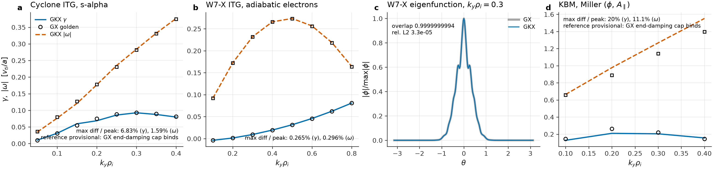
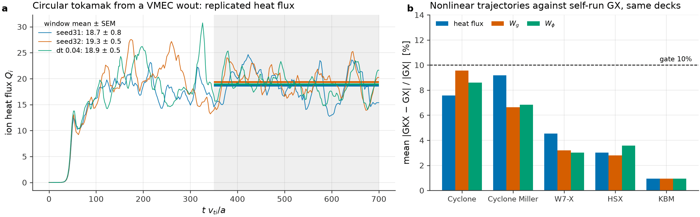
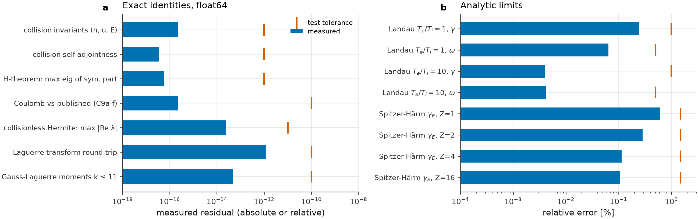
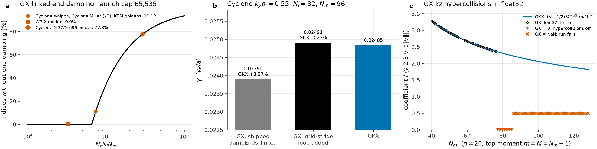

# GKX

[](https://github.com/uwplasma/GKX/releases)
[](https://pypi.org/project/gkx/)
[](https://github.com/uwplasma/GKX/actions/workflows/ci.yml)
[](https://codecov.io/gh/uwplasma/GKX)
[](LICENSE)
[](pyproject.toml)
[](https://gkx.readthedocs.io)

GKX is a JAX-native gyrokinetic solver for tokamak and stellarator flux tubes.
It takes a VMEC equilibrium or an analytic geometry, computes linear stability
and nonlinear turbulence in a Hermite-Laguerre velocity basis, and
differentiates the whole path end to end on CPUs and GPUs.

- **Run what you already have:** a VMEC or VMEX `wout`, a Miller or s-alpha
  tokamak, or one TOML deck; the executable sizes the grid and explains why.
- **Differentiate it:** implicit eigenvalue derivatives and a checkpointed
  discrete adjoint of a nonlinear heat-flux window, through the equilibrium.
- **Trust the eigenvalue:** every returned eigenpair is certified against the
  original operator, and under-resolved runs warn instead of reporting a number.
- **Model collisions properly:** five operators, up to gyrokinetic Coulomb,
  each checked against its published closed form.
- **Trace every number:** an evidence ledger ties each published figure to its
  artifact and generator, and CI recomputes them.


Saturated ITG turbulence on a Cyclone flux tube, as a perpendicular cut and as
the field-aligned tube
([full-rate movie](https://github.com/uwplasma/GKX/releases/download/v1.7.0/gkx-cyclone-itg-turbulence.mp4)).
Methods, the decisions behind them and the limits of each measurement are in
[methods and decisions](docs/algorithms.rst).

## Install

```bash
pip install gkx
gkx
```

Python 3.11+. The wheel installs CPU JAX; for GPUs install an accelerator JAX
wheel from the [JAX installation guide](https://docs.jax.dev/en/latest/installation.html).

`gkx` with no arguments runs a linear Cyclone demo in under a minute on a
laptop CPU, prints `gamma` and `omega`, and writes `gkx_default_linear.*`. Its
velocity grid is coarse, but its growth rate agrees with that case's certified
eigenvalue to better than 1%, and a gate holds it there.

## Run an equilibrium

Point the executable at a VMEC or [VMEX](https://github.com/uwplasma/vmex)
`wout` for a nonlinear ITG run, its figures, a restartable NetCDF bundle and the
resolved deck that reproduces it:

```bash
gkx wout_circular_tokamak.nc --estimate   # size the grid, explain it, exit
gkx wout_circular_tokamak.nc              # run to saturation
gkx plot wout_circular_tokamak/gkx.out.nc # replot a saved bundle
```

`--estimate` derives each grid entry from the geometry and says why:

```
geometry: shat=+1.7190 q=2.066 nfp=1 |B| wells=1 anisotropy=0.214 -> ky_max*rho >= 2.2
    ny = 96       tokamak class asks ky_max*rho >= 2.2; reach ((Ny-1)//3)*dky = 2.21 at dky = 0.071
    nl = 4        Laguerre FLR floor with hypercollisions; the scan converged at Nl=4
    nm = 8        hypercollisions: t_quiet ~ 5.5*sqrt(Nm) recurrence sets the published floor (4,8)
 t_max = 400      8 x t_sat ~ 50 hard cap; run_to = "saturation" stops earlier
```

The estimate is a calibrated starting point, not a convergence proof; matched
`Nx`/`Ny` convergence is still yours. A run stops when the heat flux, field
energy and free energy are all stationary, and an unresolved `ky` cutoff or a
missed saturation is reported as such rather than as a number. The saturation
gates are in [`saturation.py`](src/gkx/diagnostics/saturation.py).

Every deck under [examples/](examples/) runs with `gkx <deck>.toml`. The input
reference is at [inputs](https://gkx.readthedocs.io/en/latest/inputs.html).

## From Python

```python
import jax.numpy as jnp

from gkx import CycloneBaseCase, LinearParams, integrate_linear_from_config
from gkx.core_grid import build_spectral_grid
from gkx.geometry import SAlphaGeometry

cfg = CycloneBaseCase()
grid = build_spectral_grid(cfg.grid)
geometry = SAlphaGeometry.from_config(cfg.geometry)
state = jnp.zeros((2, 2, grid.ky.size, grid.kx.size, grid.z.size), dtype=jnp.complex64)
state = state.at[0, 0, 0, 0, :].set(1.0e-3)
trajectory, potential = integrate_linear_from_config(
    state, grid, geometry, LinearParams(), cfg.time
)
```

For repeated nonlinear calls, `gkx.prepare(case, steps=N)` compiles one scan
once and `warmup()` moves the compile out of the first timed `solve`. Full API:
[gkx.readthedocs.io](https://gkx.readthedocs.io).

## Linear physics



Growth rates and frequencies against GX for Cyclone ITG (a), W7-X ITG (b) and
KBM (d), and the W7-X eigenfunction at `ky rho_i = 0.3` (c), which overlaps
GX's to 0.9999999994. The Cyclone and KBM references are provisional: GX's own
end-damping defect (below) acts at those resolutions.

Parity across the tracked scans, as `100 * max|GKX - ref| / max|ref|` against
the references in
[`tools/benchmark_atlas_manifest.toml`](tools/benchmark_atlas_manifest.toml):

| Case | `gamma` | `omega` |
| --- | ---: | ---: |
| KAW | 0.0004% | 0.051% |
| ETG | 0.040% | 0.074% |
| W7-X | 0.265% | 0.296% |
| HSX | 0.577% | 0.273% |
| Cyclone Miller | 5.51% | 1.25% |
| Cyclone ITG | 6.83% | 1.59% |
| **KBM** | **20.0%** | **11.1%** |

KBM is the known outlier, published at its claim level rather than smoothed
over. This is agreement against those tracked scans, not a claim of identical
physics options or feature coverage in the reference codes. CI recomputes every
percentage from its scan. Detail: [benchmarks](docs/benchmarks.rst),
[verification matrix](docs/verification_matrix.rst).

Eigenvalues come from a matrix-free restarted eigensolver that applies the full
gyrokinetic RHS, `O(n m)` rather than `O(n^2)`. At `n = 494,592` the dense
complex128 operator alone would be 3.6 TiB. Twist-and-shift chains are solved
on the modes they couple, and every returned eigenpair is checked against the
unprojected operator: [solvers](docs/solvers.rst).

## Nonlinear turbulence



(a) A circular tokamak run straight from a VMEC `wout`, replicated with two
seeds and a second time step: window means 18.7, 19.3 and 18.9 over
`t = 350-700`, a 3.5% spread against a 15% gate. (b) Mean relative difference
from GX runs of the same decks, in heat flux, free energy `Wg` and field energy
`Wphi`, for Cyclone, Cyclone Miller, W7-X, HSX and KBM: the time average of
the pointwise relative difference along each trajectory, all below the 10%
gate. Evidence: [verification matrix](docs/verification_matrix.rst).

## Collision operators

`[time] collision_operator` selects Lenard-Bernstein/Dougherty (the default),
drift-kinetic Sugama and improved Sugama, drift-kinetic linearized Coulomb
(Frei, Ernst & Ricci 2022, Eqs. C9a-C9f), or gyrokinetic Coulomb at finite
`k_perp` (Frei et al. 2021, Eqs. 3.47-3.50). Coulomb tables are generated for
like-species collisions; a multispecies request is refused rather than silently
extrapolated. Their identities are in the proof tests below. Equations and
convergence panels: [operators](docs/operators.rst).

## Proof tests



Identities the discretization must satisfy exactly, and analytic limits it must
reach. Bars are measured by `scripts/figures.py`; ticks are the tolerances the
named tests assert in CI.

| Check | Measured | Tolerance | Test |
| --- | ---: | ---: | --- |
| Collision invariants (density, momentum, energy), all three matrix operators | 2.2e-16 | 1e-12 | [`test_collision_physics.py`](tests/validation/physics_gates/test_collision_physics.py) |
| Collision self-adjointness | 3.4e-17 | 1e-12 | same |
| H-theorem: largest eigenvalue of the symmetric part | 5.6e-17 | 1e-12 | same |
| Coulomb matrix against published Eqs. (C9a)-(C9f) | 2.2e-16 | 1e-10 | same |
| Spitzer-Härm `gamma_E(Z)`, Z = 1, 2, 4, 16 | 0.11-0.61% | 1.5% | same |
| Collisionless Hermite spectrum is real: max `|Re lambda|` | 2.4e-14 | 1e-11 | [`test_hermite_hierarchy_physics.py`](tests/validation/physics_gates/test_hermite_hierarchy_physics.py) |
| Landau root, `T_e/T_i = 1`: `gamma`, `omega` | 0.246%, 0.064% | 1%, 0.5% | same |
| Landau root, `T_e/T_i = 10`: `gamma`, `omega` | 0.004%, 0.004% | 1%, 0.5% | same |
| Laguerre transform round trip, `Nl <= 64` | 1.2e-12 | 1e-10 | [`test_core_numerics.py`](tests/unit/core/test_core_numerics.py) |
| Gauss-Laguerre moments, `k <= 11` | 4.9e-14 | 1e-10 | same |

The Landau roots solve `1 + T_i/T_e + zeta Z(zeta) = 0`. GKX reaches them by
extrapolating its own linear operator to zero collisionality: a collisionless
truncated Hermite system has a real spectrum, so the damping there is a
transient that ends at recurrence, not an eigenvalue.

## Where GX gives the wrong answer

GKX shares its Hermite-Laguerre velocity representation with
[GX](https://bitbucket.org/gyrokinetics/gx), which makes GX the closest
reference. Reading GX's source (commit `bc2fe552`) against GKX turned up two
defects that change results:



- **Moments without end damping (a, b).** GX launches `dampEnds_linked` on at
  most 65,535 `(z, l, m)` indices and, unlike its sibling kernels, has no
  grid-stride loop. Above that size the highest Hermite moments (from `m = 42`
  of 48 in the shipped goldens) get no parallel end damping. That is 11.1% of
  the indices in the four shipped linked goldens (Cyclone s-alpha, both Cyclone
  Miller decks, KBM) and 77.8% at `Nl = 32`, `Nm = 96`. At Cyclone
  `ky rho_i = 0.55` GKX differs from stock GX by 3.97% in `gamma`, and by
  0.23% once the loop is added to GX. Derivation and kernel harness:
  [GX goldens](tools/comparison/fixtures/gx_goldens/README.md).
- **Hypercollisions that switch off, then fail (c).** GX forms the
  kz-hypercollision coefficient from `M^(p+1/2)` and `m^p` separately in
  single precision, with default `p = min(20, Nm/2)`. The coefficient is
  finite up to `Nm = 76`, underflows to zero for `Nm = 77-85` (hypercollisions
  silently off), and is NaN from `Nm = 86`; an `Nm = 96` GX run wrote NaN
  fluxes from `t = 0.202`. GKX forms the power as the bounded ratio `(m/M)^p`.
  Record: [work log](plan/log.md).

The remaining differences are of scope, not correctness:

| | GKX | GX | GENE |
| --- | --- | --- | --- |
| Velocity space | Hermite-Laguerre moments | Hermite-Laguerre moments | grid in `(v_par, mu)` |
| Hardware | CPU and GPU through JAX | NVIDIA GPU (CUDA) | CPU and GPU |
| Collision models | 5, up to gyrokinetic Coulomb | Dougherty + hypercollisions | Landau and model operators |
| Derivatives | JAX autodiff end to end | not a design goal | not a design goal |

Both codes are mature and each is stronger than GKX in areas GKX does not
attempt. See [related codes](docs/codes.rst).

## Differentiate the solver

Eigenvalue derivatives use `dλ/dp = wᴴ(dA/dp)v / (wᴴv)` plus a bordered solve
for eigenvector observables, with no differentiation through the iteration
([eigensolver](docs/differentiable_eigensolver.rst)).

GKX also differentiates one production nonlinear objective: the physical heat
flux averaged over a post-saturation RK window, through a block-checkpointed
discrete adjoint that stores `O(sqrt(N))` states.

```python
def loss(shape):
    return gkx.nonlinear_heat_flux_window(
        saturated, grid, geometry(shape), params, dt, steps, terms=terms
    )

heat_flux, gradient = jax.value_and_grad(loss)(shape0)
```


On a 16x16x16 Cyclone case over a 1024-step window, checkpointing cuts temporary
state from 7.82 GB to 187 MB on CPU and from 7.80 GB to 148 MB on an RTX A4000,
for 1.92x and 1.77x the runtime. The derivative agrees with centered finite
differences to 1e-11 through 512 steps and 2.7e-9 at 1024, inside the 1e-6
gate; they part at 2048 steps, where chaotic separation sets the useful window.
[nonlinear autodiff](docs/nonlinear_autodiff.rst).

### QA shape optimization through turbulence

`QA_optimization.py` in [examples/](examples/) adds this heat flux as a fourth
objective to VMEX's vacuum QA ladder, composing VMEX's implicit equilibrium
derivative with the exact GKX window derivative.


Eight low-order boundary coefficients move; aspect ratio changes by +0.0115% and
mean iota by -0.044%, while the QA residual goes from 5.88e-4 to 1.54e-3.


These historical traces predate the periodic hypercollision correction and must
be regenerated; they are not evidence for the current operator. The preliminary
12.26% reduction across 24 nominal pairs has a conditional 95% CI of
10.64-13.88%, and is **not statistically resolved**: 4 of 48 nominal traces fail
the published per-trace final-drift test. Promotion requires stationary
individual traces, autocorrelation-aware batches, resolved spectral tails, and
grid/timestep convergence; nonlinear optimization evidence requires matched,
replicated, long post-saturation windows. Every row is in
[`qa_transport_summary.csv`](docs/_static/qa_transport_summary.csv); the campaign
is in [stellarator optimization](docs/stellarator_optimization.rst).

## Performance


Cold wall time and peak memory across the tracked cases, including JAX startup
and compilation; the executable caches compilations, so a rerun is warm. On an
Apple M3 Max (CPU, float32), cost is about 196 ns per `Nx*Ny*Nz*Nl*Nm` element
per step, flat from 64x64x24 to 96x96x48. Warm timings, GPU ratios and
profiles: [performance](docs/performance.rst).

Parallelism is production for independent `k_y` scans, quasilinear/UQ ensembles,
and file-backed tasks, all deterministically ordered and serial-identity gated.
Sensitivity sweeps can use the same deterministic independent-work
reconstruction, but they need a dedicated matched scaling artifact before any
speedup claim is promoted; nonlinear whole-state and domain decomposition stay
diagnostic only. Details: [parallelization](docs/parallelization.rst).

## Claim scope

Release claims are bounded by the [release scope](docs/release_scope.rst).

Quasilinear outputs are for ranking, correlation studies, and optimization
screening. They are **not a runtime/TOML absolute-flux predictor**: absolute-flux
promotion stays rejected while the declared Solovev and shaped-pressure stress
outliers are retained, the best tracked candidate misses the 0.35 transport
gate, and the positive-growth mixing-length rule predicts zero for HSX and W7-X
where the tracked nonlinear windows are finite. Derivations, calibration splits,
and holdout gates: [quasilinear](docs/quasilinear.rst).

Collision operators are validated for like-species collisions and run on the
fixed-step cached integrator. W7-X zonal long-window recurrence/damping and
W7-X TEM / kinetic-electron extensions are deferred. Production nonlinear
domain decomposition and equilibrium ExB flow shear remain open.

## Reproducing the figures

The four README figures under `docs/_static/readme/` regenerate with one
command, configured by [`scripts/figures.toml`](scripts/figures.toml):

```bash
JAX_ENABLE_X64=true python scripts/figures.py          # or name one: linear, nonlinear, proof_tests, gx_defects
```

Each PNG has a JSON companion holding every plotted number. The proof-test
figure takes about 7 CPU-minutes (the Landau collisionality scan); the others
take seconds and read only tracked files. The autodiff, QA and performance
figures name their generators in the [evidence ledger](tools/evidence_ledger.toml);
the turbulence movie's recipe is in `scripts/artifacts/build_turbulence_movie.py`.

## Documentation and development

Full documentation is at **[gkx.readthedocs.io](https://gkx.readthedocs.io)**:
start with the [quickstart](https://gkx.readthedocs.io/en/latest/quickstart.html),
then [physics](docs/theory.rst), [numerics](docs/numerics.rst),
[geometry](docs/geometry.rst), [outputs](docs/outputs.rst) and
[testing](docs/testing.rst).

```bash
git clone https://github.com/uwplasma/GKX
cd GKX
pip install -e ".[dev]"
pytest
python scripts/checks/run_test_gates.py fast
```

CI requires at least 95% line coverage plus the physics, convergence,
comparison, differentiability and performance gates. Bug reports, misbehaving
decks and physics questions are welcome: see [CONTRIBUTING.md](CONTRIBUTING.md)
and cite GKX with [CITATION.cff](CITATION.cff).

## License

GKX is distributed under the [MIT License](LICENSE).
