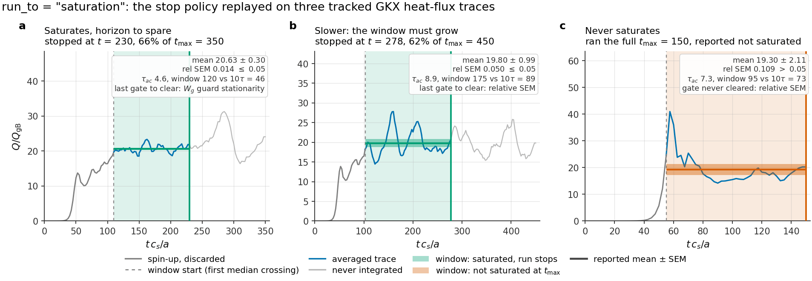

# GKX

[](https://github.com/uwplasma/GKX/releases)
[](https://pypi.org/project/gkx/)
[](https://github.com/uwplasma/GKX/actions/workflows/ci.yml)
[](https://codecov.io/gh/uwplasma/GKX)
[](LICENSE)
[](pyproject.toml)
[](https://gkx.readthedocs.io)

GKX is a JAX-native gyrokinetic solver for tokamak and stellarator flux tubes: it takes a VMEC equilibrium or an analytic geometry, computes linear stability and nonlinear turbulence in a Hermite-Laguerre velocity basis, and supports differentiable objectives on CPUs and GPUs. Nonlinear derivatives are of a declared finite window; validated long-time transport optimization remains an open research goal.

**Research status (2026-09-04):** 2.0.0 has an open [end-damping regression](https://github.com/uwplasma/GKX/issues/192). Affected benchmarks need a repaired operator and revalidation. The [roadmap](plan.md) and [research-readiness checklist](docs/research_grade_plan.rst) separate implemented features, current evidence and the remaining work.

**Direction:** research-grade ES/EM multispecies turbulence and optimization,
with advanced collisions, radial electric fields and scalable derivatives—from
VMEX equilibria to ESSOS coil fields, including islands. The local solver is the
starting point; the [model-development gates](docs/research_grade_program.rst)
identify what must be built and validated before those broader regimes are supported.


Saturated ITG turbulence on a Cyclone flux tube: the perpendicular cut, and the
same data as the field-aligned tube in real space. Amplitude is steady across
the loop, not growing.
[Full-rate movie](https://github.com/uwplasma/GKX/releases/download/v1.7.0/gkx-cyclone-itg-turbulence.mp4).

## Install

```bash
pip install gkx
gkx --help
gkx
```

Python 3.11+. The wheel installs CPU JAX; for GPU or TPU, install an
accelerator-enabled JAX wheel from the
[JAX installation guide](https://docs.jax.dev/en/latest/installation.html).

`gkx` with no arguments runs a self-contained linear Cyclone demo — no input
file, no data download. It takes about 20 s on a laptop CPU, prints the fitted
`gamma` and `omega`, and writes
`gkx_default_linear.{toml,summary.json,timeseries.csv,eigenfunction.csv,png}`.
It is a smoke test, not a converged result, and emits CFL and under-resolution
warnings to say so.

Development checkout:

```bash
git clone https://github.com/uwplasma/GKX
cd GKX
pip install -e ".[dev]"
```

## Run an equilibrium

Point the executable at a VMEC or [VMEX](https://github.com/uwplasma/vmex)
`wout` file to get a nonlinear ITG run, its figures, a restartable NetCDF
bundle, and the resolved deck that reproduces it — without writing a TOML first.

```bash
gkx wout_circular_tokamak.nc --estimate   # size the grid, print reasoning, exit
gkx wout_circular_tokamak.nc              # run it
gkx plot wout_circular_tokamak/gkx.out.nc # replot a saved bundle
```

`--estimate` derives a minimum grid from the geometry and explains every entry:

```
equilibrium: /path/to/wout_circular_tokamak.nc
geometry: shat=+1.7190 q=2.066 nfp=1 |B| wells=1 anisotropy=0.214 -> ky_max*rho >= 2.2
    nx = 96       square perpendicular box (Lx = Ly), so Nx tracks Ny
    ny = 96       tokamak class (nfp = 1, anisotropy 0.214) asks ky_max*rho >= 2.2 (standard); reach ((Ny-1)//3)*dky = 2.21 at dky = 0.071
    nz = 48       scan found Nz weakly coupled (flux 8.47/8.78/8.39 at 24/32/48); floors: 16/2pi-period x 1, 6 x 1 |B| wells
    nl = 4        Laguerre FLR floor with hypercollisions; the scan converged at Nl=4
    nm = 8        hypercollisions: t_quiet ~ 5.5*sqrt(Nm) recurrence sets the published floor (4,8)
    dt = 0.0071   explicit CFL bound cfl_fac*cfl/sum(omega_max) at this grid; the adaptive stepper raises it toward the measured ExB limit
 t_max = 400      8 x t_sat ~ 50 hard cap; run_to = "saturation" stops earlier
```

`--estimate=cautious` and `--estimate=standard` select the target-error tier.
This is a calibrated starting point, not a convergence proof: tokamak rungs
saturated with `64^2` about 8% above the converged `96/128` flux, while the
stellarator ladder was still falling at `128^2`. Matched `Nx`/`Ny` convergence
is still yours.

A completed run groups everything under `./<wout-stem>/`:

| Artifact | Contents |
| --- | --- |
| `gkx.toml` | the fully resolved deck that reproduces this run |
| `gkx.summary.json` | fitted scalars, saturation verdict, and the averaging window |
| `gkx.out.nc` | diagnostic history, geometry, spectra, and input metadata |
| `gkx.big.nc` | final spectral and real-space fields and moments |
| `gkx.restart.nc` | packed Hermite-Laguerre state for continuation |
| `gkx.{flux_time,flux_spectra,phi2_spectra,snapshot_xy,flux_tube_3d,summary}.png` | the standard figure set |

An under-resolved run warns instead of reporting the number:

```
warning: heat-flux ky cutoff is unresolved: the highest 10% of retained positive-ky modes reach 100% of the spectral peak (warning threshold 10%). Increase Ny at fixed Ly, then repeat matched Nx/Ny convergence; this warning is necessary, not sufficient, for resolution.
saturation: not saturated by the time horizon window=[3.06144,6] heat_flux=3.15837e-06+/-3.70499e-07 rel_sem=0.117307 tau_ac=0.521488
```

### Run a checked-in case

Every shipped example is a runtime TOML the executable accepts directly:

```bash
gkx examples/linear/axisymmetric/cyclone.toml
gkx run-runtime-nonlinear \
  --config examples/nonlinear/axisymmetric/runtime_cyclone_nonlinear.toml \
  --steps 200 --out cyclone.out.nc
gkx plot cyclone.out.nc
```

The first prints the converged eigenvalue and its residual from the certified
Krylov path:

```
runtime: adaptive solve finished with eig=0.0930891-0.282015j residual=6.08e-05 converged=True stable=True
ky=0.3000 gamma=0.093089 omega=0.282015
```

`gkx run` auto-detects linear versus nonlinear from `[physics]`. A deck without
an `[output] path` and without `--out` writes no files. Examples live under
[`examples/linear`](examples/linear), [`examples/nonlinear`](examples/nonlinear),
[`examples/optimization`](examples/optimization),
[`examples/theory_and_demos`](examples/theory_and_demos), and
[`benchmarks`](benchmarks).

## Configure a run

One TOML file. Every key has a default, so a working input is short. The shipped
default deck is [`examples/common_input.toml`](examples/common_input.toml); the
key-by-key reference is [inputs](https://gkx.readthedocs.io/en/latest/inputs.html).

| Section | Controls | Common keys |
| --- | --- | --- |
| `[[species]]` | one block per species | `charge`, `mass`, `temperature`, `tprim`, `fprim`, `nu`, `kinetic` |
| `[grid]` | resolution and box | `Nx`, `Ny`, `Nz`, `Lx`, `Ly`, `boundary` |
| `[geometry]` | equilibrium | `model`, `q`, `s_hat`, `epsilon`, `R0`, `geometry_file` |
| `[time]` | integration | `t_max`, `dt`, `method`, `run_to`, `collision_operator` |
| `[physics]` | what to include | `linear`, `nonlinear`, `electrostatic`, `adiabatic_electrons`, `tau_e` |
| `[init]` | initial condition | `init_field`, `init_amp`, `gaussian_width` |
| `[collisions]` | collision and hypercollision rates | `nu_hermite`, `nu_laguerre`, `nu_hyper`, `p_hyper` |
| `[terms]` | switch individual terms on/off (0/1) | `streaming`, `mirror`, `curvature`, `diamagnetic`, `nonlinear` |
| `[run]`, `[scan]` | single run / `k_y` scan resolution | `ky`, `Nl`, `Nm`, `solver` |
| `[normalization]` | benchmark normalization contract | `contract`, `diagnostic_norm` |
| `[fit]` | growth-rate fit window | `auto_window`, `window_method` |

`[terms]` is the debugging lever: setting one coefficient to `0.0` removes
exactly that term, which is how most physics gates isolate what they test.

| `[geometry] model` | Gives you | Needs |
| --- | --- | --- |
| `"s-alpha"` | circular tokamak, `B = B0/(1 + eps cos theta)` | `q`, `s_hat`, `epsilon`, `R0` |
| `"slab"` | uniform field, sharpest numerics tests | grid only |
| `"imported-eik"` / `"vmec-eik"` | Miller or full 3D stellarator from a file | `geometry_file` |

Miller equilibria and VMEC/Boozer flux tubes are also built in-process through
the Python API, where the metric coefficients stay differentiable — the path
stellarator shape optimization uses. See [geometry](docs/geometry.rst).

GKX also consumes a [VMEX](https://github.com/uwplasma/vmex) stellarator-mirror
hybrid directly from memory, with no file round trip: VMEX owns the field-line
closure, the Clebsch metric, and the equal-arc grid, and GKX evaluates its
linear and quasilinear objectives on them. The parallel direction is a periodic
FFT, so the field line must close; open-ended mirrors are a different model and
are not admitted. The shipped case is a closed racetrack, solved to a converged
fixed-boundary equilibrium before anything is measured on it, and the
field-strength ratio its figure reports is a flux-tube modulation depth rather
than a mirror ratio. Geometry, that figure, and the admission review:
[geometry](docs/geometry.rst#closed-vmex-mirror-geometry).

### Run control

| Key | Default | Effect |
| --- | --- | --- |
| `[time] run_to = "saturation"` | on for diagnosed nonlinear runs | integrate in chunks and stop once the heat flux is stationary |
| `[time] run_to = "t_max"` | — | fixed horizon; `--no-until-saturated` does the same from the CLI |
| `[time] t_max` | deck | hard cap either way |
| `[time] saturation_rel_sem` | `0.05` | stop when the autocorrelation-corrected relative SEM of the windowed mean falls below this |
| `[time] saturation_min_window` | 10 autocorrelation times | shortest window allowed to declare saturation |
| `[time] method` | `rk3` | explicit integrator |
| `[time] collision_operator` | `lenard_bernstein` | see the collision table below |

Saturation also requires the two halves of the window to agree within twice
their combined SEM, and holds the field energy `Wphi` and free energy `Wg` to
the same stationarity, so a flat-looking flux over a still-evolving state does
not count as converged.



The stop policy replayed on three tracked runs, each stopped by a different
gate: an ITER-model case that clears the flux gates early but waits on `Wg`
stationarity and stops at 66% of `t_max`; a circular-tokamak case where the
relative SEM is binding, stopping at 62%; and an under-resolved D-shape case
whose relative SEM never falls below the threshold, so it runs the full horizon
and the summary reports *not saturated* rather than a number. Grey is the
horizon that would never have been integrated.
Gates: [`src/gkx/diagnostics/saturation.py`](src/gkx/diagnostics/saturation.py).

## Performance


Cold wall time and peak memory across the tracked cases, including JAX startup
and compilation. The executable enables JAX's persistent compilation cache, so
a rerun of an unchanged case is warm. Warm timings, per-case GPU ratios, and
profiler artifacts: [performance](docs/performance.rst).

On an Apple M3 Max (JAX CPU, float32) the shipped default deck at `96x96x48`
runs `t_max = 200` in roughly 1.0–1.6 hours, about 97% of it time stepping.
Cost is linear in degrees of freedom at about 196 ns per `Nx*Ny*Nz*Nl*Nm`
element per step, flat from 64x64x24 to 96x96x48. Within a step, about 60% is
data movement and 39% the FFTs; physics arithmetic is not separately measurable
because XLA fuses it into those kernels.

Parallelism is production for independent `k_y` scans, quasilinear/UQ ensembles,
and file-backed tasks, all deterministically ordered and serial-identity gated.
Sensitivity sweeps can use the same deterministic independent-work
reconstruction, but they need a dedicated matched scaling artifact before any
speedup claim is promoted; nonlinear whole-state and domain decomposition stay
diagnostic only. Details: [parallelization](docs/parallelization.rst).

## From Python

```python
import jax.numpy as jnp

from gkx import CycloneBaseCase, LinearParams, integrate_linear_from_config
from gkx.core_grid import build_spectral_grid
from gkx.geometry import SAlphaGeometry

cfg = CycloneBaseCase()
grid = build_spectral_grid(cfg.grid)
geometry = SAlphaGeometry.from_config(cfg.geometry)
state = jnp.zeros((2, 2, grid.ky.size, grid.kx.size, grid.z.size), dtype=jnp.complex64)
state = state.at[0, 0, 0, 0, :].set(1.0e-3)
trajectory, potential = integrate_linear_from_config(
    state, grid, geometry, LinearParams(), cfg.time
)
```

For repeated nonlinear calls with fixed geometry and numerical policy, prepare
the compiled simulation once and reuse it:

```python
from gkx.solvers_nonlinear_diagnostic_integration import prepare_nonlinear_explicit_diagnostics

simulation = prepare_nonlinear_explicit_diagnostics(
    initial_state, grid, geometry, parameters,
    dt=0.02, steps=400, resolved_diagnostics=False,
)
time, diagnostics, final_state, fields = simulation.run()
```

The prepared object accepts another same-shape initial state without rebuilding
the scan, and a matched cache/parameter PyTree can stay dynamic for autodiff.
Full API: [gkx.readthedocs.io](https://gkx.readthedocs.io).

## What GKX solves

The gyrokinetic equation for the perturbed distribution of each species,
expanded in a **Hermite-Laguerre** velocity basis:

```
delta f_s = F_Maxwellian * sum_{m,l}  G_s^{m,l}  psi_m(v_par / v_th)  L_l(mu B / T)
```

with `psi_m = H_m / sqrt(2^m m! sqrt(pi))` the normalized Hermite functions and
`L_l` the Laguerre polynomials. Velocity space becomes two spectral indices: `m`
resolves parallel dynamics (Landau damping, parallel heat flux), `l` resolves
perpendicular dynamics (FLR effects, trapping). The evolved state is one array,
`G[species, laguerre l, hermite m, ky, kx, z]`, and each physical effect is a
coupling on it:

| Term | What it does to `G` | Set by |
| --- | --- | --- |
| Parallel streaming | couples `m` to `m±1` (a ladder in Hermite index) | geometry `gradpar` |
| Magnetic mirror | couples `m` and `l` together | `bgrad` |
| Curvature / grad-B drift | multiplies by `i(k · v_d)` | geometry curvature |
| Diamagnetic drive | injects free energy from the gradients | `[[species]] tprim`, `fprim` |
| Collisions | couples moments within a species | `collision_operator` |
| Nonlinearity | `E × B` convolution in `(kx, ky)`, pseudo-spectral | nonlinear solver |
| Field solve | quasineutrality + parallel Ampere for `phi`, `A_par`, `B_par` | `beta`, species list |

Perpendicular directions are Fourier (`kx`, `ky`); the parallel direction `z`
follows a field line. Electrons are kinetic or Boltzmann. Because `m` and `l`
are the same kind of index as `kx` and `ky`, the whole problem is dense linear
algebra on one array. Derivation: [theory](docs/theory.rst).

**Velocity resolution.** Truncating the Hermite ladder at `m = M` makes its end
a reflecting wall, returning free energy as recurrence at
`t_rec ~ 2 sqrt(M) / (k_par v_th)`. Since `t_rec` grows only as `sqrt(M)`,
adding moments is a weak fix and the ladder has to absorb instead. Hypercollisions
are the default and cut the revival to 0.0009 at `M = 16`; an opt-in
reflectionless closure (Kanekar et al., JPP **81**, 305810104 (2015)) needs no
tuning but does not beat a well-tuned hypercollision. Tables and scans:
[numerics](docs/numerics.rst).

## Collision operators

| `collision_operator` | Model | Reference |
| --- | --- | --- |
| `none` / `lenard_bernstein` | Conserving diagonal Lenard-Bernstein/Dougherty relaxation | built in |
| `sugama` | Drift-kinetic Sugama, conservative by construction | Frei, Ernst & Ricci (2022), Eqs. (C6a)-(C6f) |
| `improved_sugama` | Improved Sugama, corrected Pfirsch-Schlüter friction | Sugama et al. (2019); Frei, Ernst & Ricci (2022) |
| `coulomb` | Drift-kinetic linearized Coulomb (Landau) | Frei, Ernst & Ricci (2022), Eqs. (C9a)-(C9f) |
| `coulomb_finite_kperp` | Gyrokinetic Coulomb retaining finite `k_perp` | Frei, Ball, Hoffmann, Jorge, Ricci & Stenger (2021), Eqs. (3.47)-(3.50) |


The models approach the collisionless limit and separate as collisionality
rises. The archived verification report checks selected coefficients,
invariants and projections in an eight-moment basis; it explicitly covers
**offline operator algebra, not runtime transport**. Shipped Coulomb tables
are like-species: eight moments in the drift-kinetic limit and 8/18 at finite
perpendicular wavelength. Unsupported requests are rejected. General
multispecies/high-order support and the complete finite-k weighted entropy
balance remain [validation work](plan.md#collisions-and-closure).
Equations and convergence panels: [operators](docs/operators.rst), metrics in
[`collision_operator_verification.json`](docs/_static/collision_operator_verification.json).

## Validation

Every figure is anchored to an exact root, a published coefficient, or a
tracked reference run.

**Landau damping** against the roots of `1 + T_i/T_e + zeta Z(zeta) = 0`, from
GKX's own linear operator extrapolated to zero collisionality:

| | exact | GKX | error |
| --- | --- | --- | --- |
| `T_e/T_i = 1`, `omega` | 2.045904866 | 2.047220793 | 0.064% |
| `T_e/T_i = 1`, `gamma` | -0.851330459 | -0.849234188 | 0.246% |
| `T_e/T_i = 10`, `omega` | 3.728834801 | 3.728993838 | 0.004% |
| `T_e/T_i = 10`, `gamma` | -0.058337421 | -0.058339802 | 0.004% |

A collisionless truncated Hermite system has a purely real spectrum (measured
2.8e-14, gated below 1e-11), so it cannot Landau damp at all — the damping is a
transient ending at recurrence, and the root is a pole reached by `nu -> 0`
extrapolation, not an eigenvalue.

**Linear benchmark parity**, as `100 * max|GKX - ref| / max|ref|` over each scan
against the references in
[`tools/benchmark_atlas_manifest.toml`](tools/benchmark_atlas_manifest.toml):

| Case | `gamma` | `omega` |
| --- | ---: | ---: |
| KAW | 0.0004% | 0.051% |
| ETG | 0.040% | 0.074% |
| W7-X | 0.265% | 0.296% |
| HSX | 0.577% | 0.273% |
| Cyclone Miller | 5.51% | 1.25% |
| Cyclone ITG | 6.83% | 1.59% |
| **KBM** | **20.0%** | **11.1%** |

KBM is the known outlier, published at its claim level rather than smoothed
over. This is agreement against those tracked scans, not a claim of identical
physics options or feature coverage in the reference codes. Detail:
[benchmarks](docs/benchmarks.rst) and the
[verification matrix](docs/verification_matrix.rst).

## Differentiate the solver

GKX applies the full gyrokinetic RHS inside a restarted eigensolver, so storage
is `O(n m)` rather than `O(n²)`. The dense path is bounded by memory, not speed:
at `n = 494,592` a complex128 operator alone would be 3.6 TiB, while the
matrix-free solve took 1,504 s.

```python
settings = gkx.AdaptiveLinearEigensolverConfig(tolerance=1e-9, candidate_count=2)

def objective(boundary):
    values = gkx.solver_objective_vector_from_geometry(
        build_solver_geometry(boundary),
        n_laguerre=16, n_hermite=24,
        eigensolver="adaptive-propagator", adaptive_config=settings,
    )
    return values[-1]          # quasilinear transport objective

value, gradient = jax.value_and_grad(objective)(initial_shape)
```

Reverse mode uses `dλ/dp = wᴴ(dA/dp)v / (wᴴv)` plus a bordered solve for
eigenvector observables — no differentiation through the iteration. The default
stays dense so established results are unchanged. See
[eigensolver](docs/differentiable_eigensolver.rst).

GKX also differentiates one production nonlinear objective: the physical heat
flux averaged over a post-saturation RK window, via a block-checkpointed
discrete adjoint storing `O(sqrt(N))` states.

```python
def loss(shape):
    return gkx.nonlinear_heat_flux_window(
        saturated, grid, geometry(shape), params, dt, steps, terms=terms
    )

heat_flux, gradient = jax.value_and_grad(loss)(shape0)
```


On a 16x16x16 Cyclone case over a 1024-step window, checkpointing cuts measured
temporary state from 7.82 GB to 187 MB on CPU and 7.80 GB to 148 MB on an RTX
A4000, for 1.92x and 1.77x more runtime. The exact discrete differentiation and
centered finite differences agree to 1e-11 through 512 steps and 2.7e-9 at 1024,
inside the 1e-6 gate, and part at 2048 where chaotic trajectory separation sets
the useful window length. [nonlinear autodiff](docs/nonlinear_autodiff.rst).

### QA shape optimization through turbulence

[`QA_optimization.py`](examples/optimization/QA_optimization.py) adds this heat
flux as a fourth objective to VMEX's vacuum QA ladder, composing VMEX's implicit
equilibrium derivative with the exact GKX window derivative.


Eight low-order boundary coefficients move; aspect ratio changes by +0.0115% and
mean iota by -0.044%, while the QA residual goes from 5.88e-4 to 1.54e-3.


The startup spike is excluded and the shaded window is measured. The preliminary
12.26% reduction across 24 nominal pairs has a conditional 95% CI of
10.64-13.88%, and is **not statistically resolved**: 4 of 48 nominal traces fail
the published per-trace final-drift test. Promotion requires stationary
individual traces, autocorrelation-aware batches, resolved spectral tails, and
grid/timestep convergence; nonlinear optimization evidence requires matched,
replicated, long post-saturation windows. Every row is in
[`qa_transport_summary.csv`](docs/_static/qa_transport_summary.csv); the campaign
is in [stellarator optimization](docs/stellarator_optimization.rst).

## How GKX compares

GKX shares its Hermite-Laguerre gyro-moment velocity representation with GX,
which makes GX the closest algorithmic and parity reference.

| | GKX | GX | GENE |
| --- | --- | --- | --- |
| Velocity space | Hermite-Laguerre moments | Hermite-Laguerre moments | grid in `(v_par, mu)` |
| Collision models | Lenard–Bernstein/Dougherty, Sugama, improved Sugama; finite-k Coulomb tables are research-only, under coefficient repair | Dougherty + hypercollisions | Landau and model operators |
| Differentiable | JAX autodiff end to end | not a design goal | not a design goal |

This records scope, not quality: both codes are mature and each is stronger than
GKX in areas GKX does not attempt. See [related codes](docs/codes.rst).

## Claim scope

Release claims are bounded by the [release scope](docs/release_scope.rst).

Quasilinear outputs are for ranking, correlation studies, and optimization
screening. They are **not a runtime/TOML absolute-flux predictor**: absolute-flux
promotion stays rejected while the declared Solovev and shaped-pressure stress
outliers are retained, the best tracked candidate misses the 0.35 transport
gate, and the positive-growth mixing-length rule predicts zero for HSX and W7-X
where the tracked nonlinear windows are finite. Derivations, calibration splits,
and holdout gates: [quasilinear](docs/quasilinear.rst).

Advanced collision evidence is restricted to supported tables/models on the
fixed-step cached integrator; it does not establish general collisional transport.
W7-X zonal long-window recurrence/damping and
W7-X TEM / kinetic-electron extensions are deferred. Production nonlinear
domain decomposition and equilibrium ExB flow shear remain open.

## Reproducing the figures

Every figure regenerates from a checked-in script; where a figure has a
machine-readable companion, that companion is the artifact of record.

| Figure | Command |
| --- | --- |
| `turbulence_loop.webp` | `tools/artifacts/build_turbulence_movie.py` (two-stage; recipe in its docstring) |
| `collision_operator_comparison.png` | `examples/theory_and_demos/collision_operator_comparison.py` with `NU_SCAN = True` |
| `collision_operator_verification.png` | `tools/artifacts/build_linear_validation_artifacts.py collision-verification` |
| `landau_damping_validation.png` | `tools/artifacts/build_landau_damping_figure.py` |
| `benchmark_linear_parity.png` | `tools/artifacts/build_benchmark_parity_figure.py` |
| `eigensolver_reach.png` | `tools/artifacts/build_eigensolver_reach_figure.py` |
| `autodiff_inverse_twomode.png` | `examples/theory_and_demos/autodiff_inverse_twomode.py` |
| `nonlinear_autodiff_validation.png` | `tools/artifacts/build_nonlinear_autodiff_figure.py` |
| `qa_transport_equilibria.png`, `qa_transport_reduction.svg` | `tools/artifacts/build_qa_transport_figures.py` |
| `quasilinear_stellarator_usefulness.png` | generator retired — not regenerable; JSON companion is the record |
| `saturation_examples.png` | `tools/artifacts/build_saturation_figure.py` |
| `runtime_memory_benchmark.png` | `tools/artifacts/build_runtime_memory_figure.py` (re-renders from the tracked CSV); `benchmarks/performance/benchmark_runtime_memory.py` re-measures it |

## Documentation and development

Full documentation is at **[gkx.readthedocs.io](https://gkx.readthedocs.io)**.
Start with the [quickstart](https://gkx.readthedocs.io/en/latest/quickstart.html)
and [input reference](https://gkx.readthedocs.io/en/latest/inputs.html), then
[physics](docs/theory.rst), [operators](docs/operators.rst),
[numerics](docs/numerics.rst), [geometry](docs/geometry.rst),
[outputs](docs/outputs.rst), [testing](docs/testing.rst),
[code structure](docs/code_structure.rst), and
[release scope](docs/release_scope.rst).

```bash
pytest
python tools/release/run_test_gates.py fast
ruff check .
python -m sphinx -W -b html docs docs/_build/html
```

The package-wide CI coverage gate is at least 95%. Physics, convergence,
comparison, differentiability, and performance gates are required in addition to
line coverage.

## License

GKX is distributed under the [MIT License](LICENSE).
