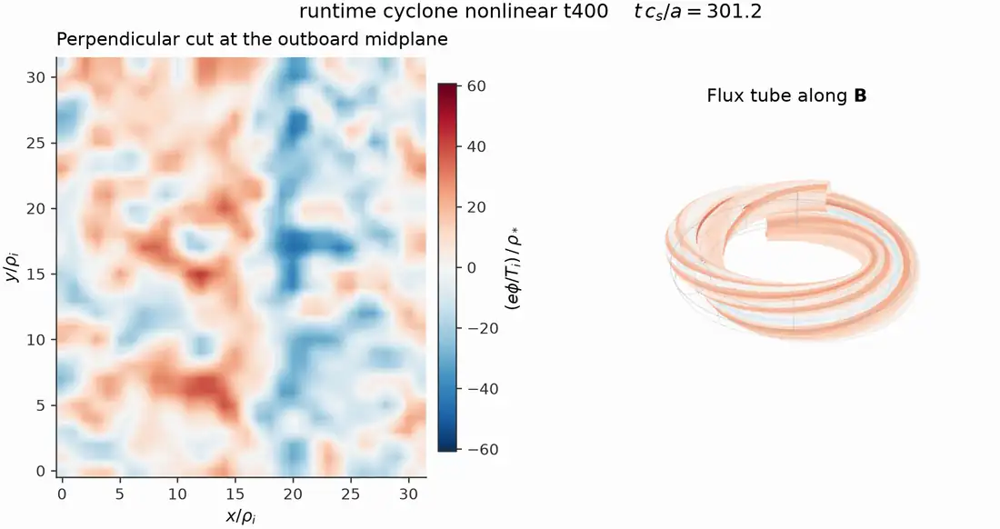
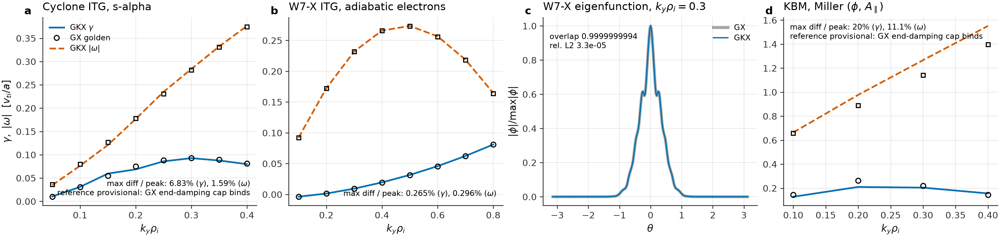
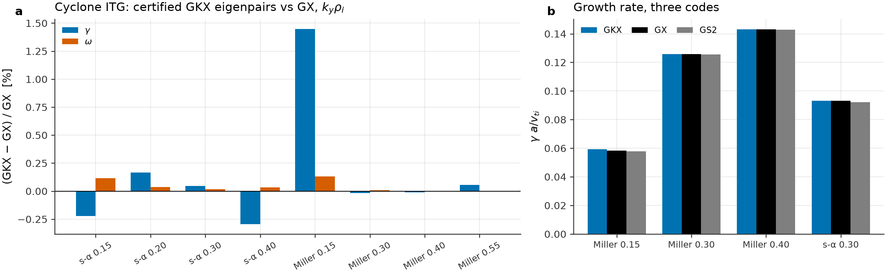
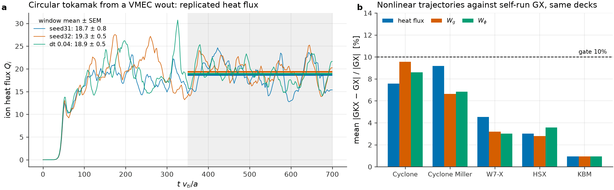
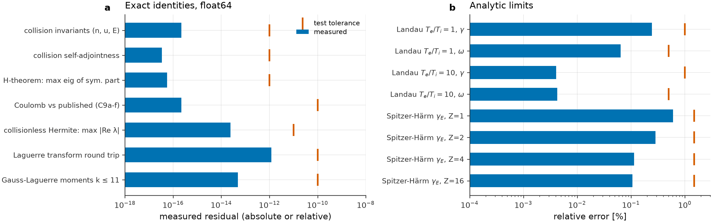
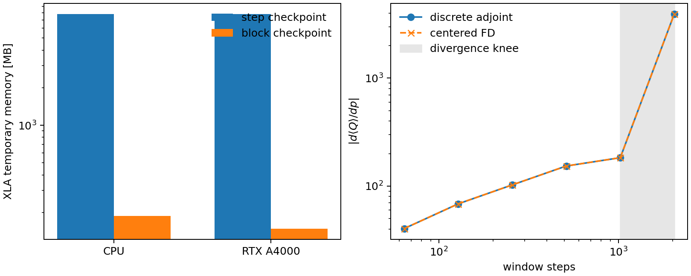
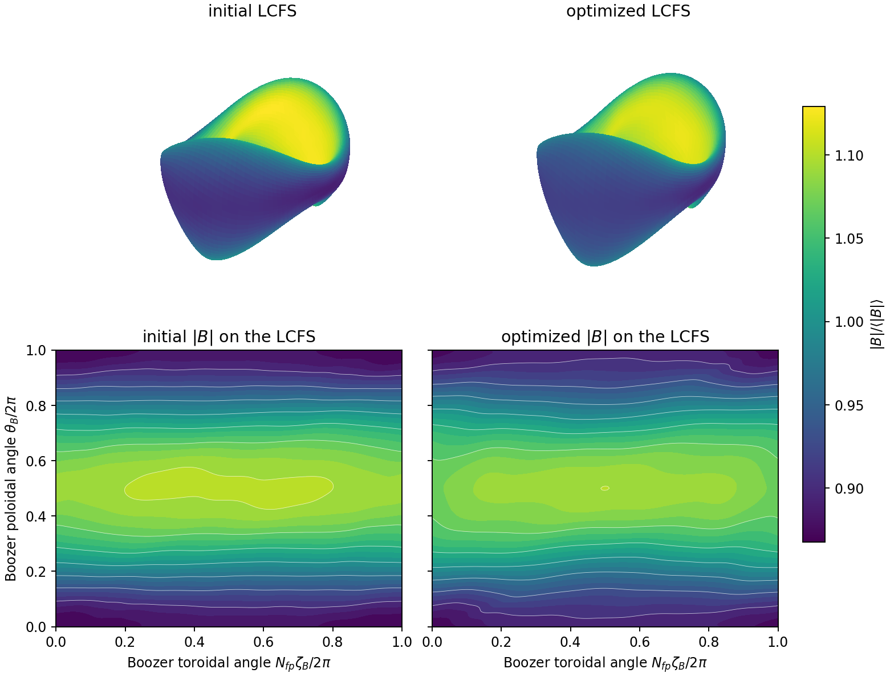
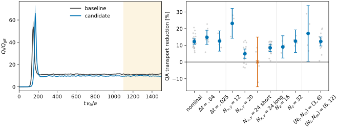
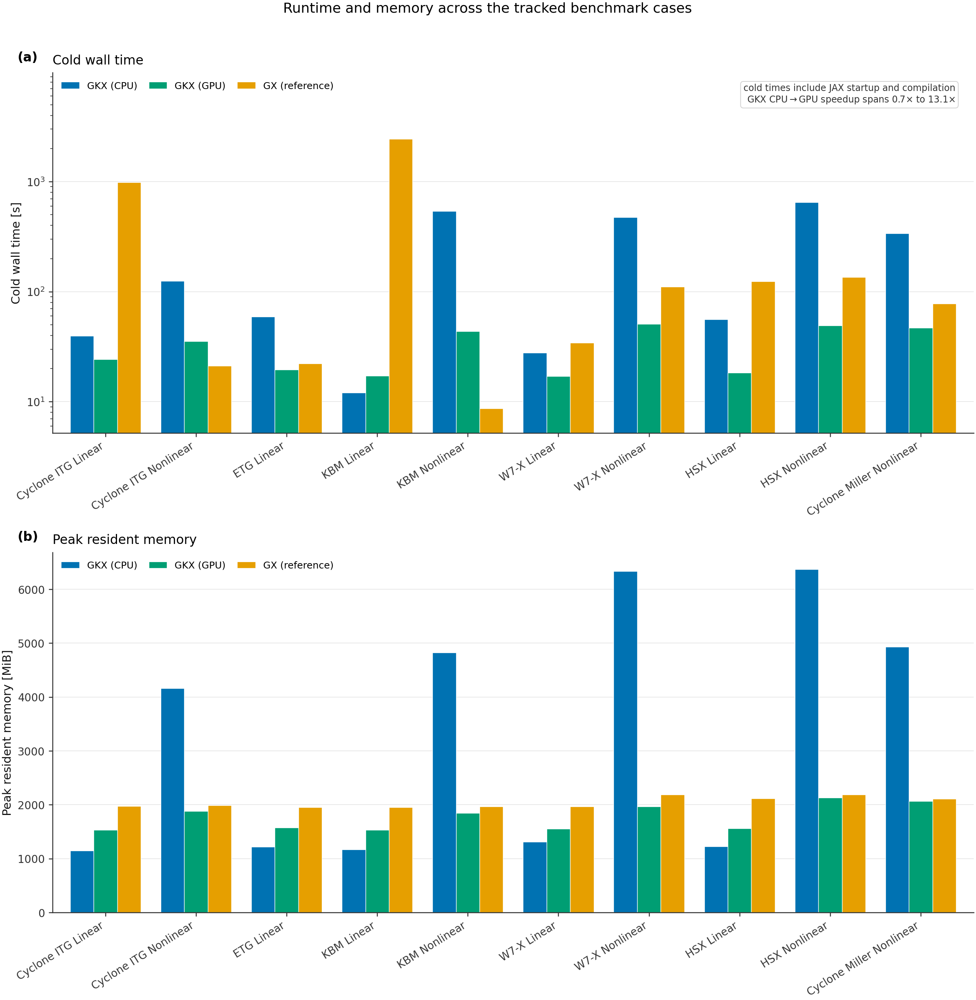

# GKX

[](https://github.com/uwplasma/GKX/releases)
[](https://pypi.org/project/gkx/)
[](https://github.com/uwplasma/GKX/actions/workflows/ci.yml)
[](https://codecov.io/gh/uwplasma/GKX)
[](LICENSE)
[](pyproject.toml)
[](https://gkx.readthedocs.io)

GKX is a JAX gyrokinetic solver for tokamak and stellarator flux tubes. It
reads a VMEC or VMEX equilibrium, or builds an analytic Miller or s-alpha
geometry, and computes linear stability and nonlinear turbulence in a
Hermite-Laguerre velocity basis. The whole path, equilibrium included, is
differentiable on CPUs and GPUs.

- **Run what you have:** a VMEC/VMEX `wout`, a Miller or s-alpha tokamak, or
  one TOML deck. The executable sizes the grid and says why.
- **Trust the eigenvalue:** every returned eigenpair is checked against the
  full operator; an under-resolved run warns instead of reporting a number.
- **Differentiate it:** implicit eigenvalue derivatives, and a checkpointed
  adjoint of the nonlinear heat flux over a saturated window.
- **Optimize with it:** the heat flux, growth rate or quasilinear flux is an
  objective in VMEX stellarator shape optimization.



Saturated ITG turbulence on a Cyclone flux tube
([full-rate movie](https://github.com/uwplasma/GKX/releases/download/v1.7.0/gkx-cyclone-itg-turbulence.mp4)).

## Install

```bash
pip install gkx
gkx
```

Python 3.11+. The wheel installs CPU JAX; for GPUs add an accelerator JAX
wheel ([JAX install guide](https://docs.jax.dev/en/latest/installation.html)).
`gkx` with no arguments runs a linear Cyclone demo in under a minute on a
laptop CPU and prints `gamma` and `omega`; its growth rate is within 1% of the
certified eigenvalue for that case, and a CI gate holds it there.

## Run a case

```bash
gkx wout_circular_tokamak.nc --estimate   # size the grid, explain it, exit
gkx wout_circular_tokamak.nc              # nonlinear ITG run to saturation
gkx plot wout_circular_tokamak/gkx.out.nc # replot a saved bundle
gkx examples/01_linear_tokamak/case.toml  # any TOML deck
```

`--estimate` derives each grid entry from the geometry:

```
geometry: shat=+1.7190 q=2.066 nfp=1 |B| wells=1 anisotropy=0.214 -> ky_max*rho >= 2.2
    ny = 96       tokamak class asks ky_max*rho >= 2.2; reach ((Ny-1)//3)*dky = 2.21 at dky = 0.071
    nl = 4        Laguerre FLR floor with hypercollisions; the scan converged at Nl=4
    nm = 8        hypercollisions: t_quiet ~ 5.5*sqrt(Nm) recurrence sets the published floor (4,8)
 t_max = 400      8 x t_sat ~ 50 hard cap; run_to = "saturation" stops earlier
```

The estimate is a starting point, not a convergence proof. A run stops when
heat flux, field energy and free energy are all stationary; a missed
saturation is reported as such. Each run writes figures, a restartable NetCDF
bundle and the resolved deck that reproduces it.
[Inputs](https://gkx.readthedocs.io/en/latest/inputs.html) ·
[outputs](https://gkx.readthedocs.io/en/latest/outputs.html).

## From Python

```python
import jax.numpy as jnp

from gkx import CycloneBaseCase, LinearParams, integrate_linear_from_config
from gkx.core_grid import build_spectral_grid
from gkx.geometry import SAlphaGeometry

cfg = CycloneBaseCase()
grid = build_spectral_grid(cfg.grid)
geometry = SAlphaGeometry.from_config(cfg.geometry)
state = jnp.zeros((2, 2, grid.ky.size, grid.kx.size, grid.z.size), dtype=jnp.complex64)
state = state.at[0, 0, 0, 0, :].set(1.0e-3)
trajectory, potential = integrate_linear_from_config(
    state, grid, geometry, LinearParams(), cfg.time
)
```

For repeated nonlinear calls, `gkx.prepare(case, steps=N)` compiles once and
`warmup()` moves the compile out of the first timed `solve`.

## Examples

[examples/](examples/) is a numbered gallery. Each directory has a `run.py`
with editable parameters at the top, a `case.toml` that runs in seconds to a
minute on a laptop, and, where it applies, a literature-resolution
`case_full.toml`.

```bash
python examples/03_nonlinear_tokamak/run.py
```

| | |
| --- | --- |
| 01, 02 | linear ITG scans, tokamak and VMEC stellarator |
| 03, 04 | nonlinear ITG, tokamak and stellarator |
| 05, 06, 07 | kinetic electrons, electromagnetic KBM, every collision operator |
| 08, 09 | quasilinear spectra, autodiff parameter recovery and geometry sensitivities |
| 10 | VMEX QA optimization with a nonlinear heat-flux objective |
| 11, 12 | parallel `k_y` scan, restart and trace analysis |

## Linear stability



Growth rate and frequency scans for Cyclone ITG (a), W7-X ITG (b) and KBM (d),
and the W7-X eigenfunction at `ky rho_i = 0.3` (c), whose overlap with GX's is
0.9999999994. Eigenvalues come from a matrix-free restarted eigensolver that
applies the full gyrokinetic right-hand side, or from a sparse direct
shift-invert solve; both certify the returned pair against the unprojected
operator ([solvers](docs/solvers.rst)).

```bash
python examples/01_linear_tokamak/run.py      # Cyclone ky scan and eigenfunction
```

## Benchmarks and cross-code comparison



(a) Certified GKX eigenpairs (Nl = 16, Nm = 48) on the Cyclone s-alpha and
Miller decks against GX runs of the same decks, with GX's end-damping launch
limit repaired. The growth rate agrees to within 0.3% at seven of eight
`k_y`, and to 1.45% at Miller `ky rho_i = 0.15`; the frequency agrees to
within 0.13% everywhere. (b) The growth rate from three codes: GKX is within
0.3% of converged GS2 at Miller `ky rho_i` 0.30 and 0.40, and 1.0% at s-alpha
0.30. Miller 0.15 is the one point where the three codes spread by more than
1%. Record: [cross-code benchmark](plan/research/2026-09-27-xcode/REPORT.md).

- **GS2 and GX with kinetic electrons** (Cyclone Miller) agree to 1.2% and
  0.2% at `ky rho_i` 0.30 and 0.50; the GKX eigenpair for this case is next.
- **stella** gives a growth rate about 1.4 times the other codes on the
  same Cyclone input. In the build tested, stella's growth rate moves by 0.3%
  when its mirror term is switched off, while in GKX the mirror force is 14% of
  `gamma`; that term is the lead being followed.
- **s-alpha `ky rho_i = 0.55`** is weakly growing and not converged in either
  GS2's energy grid or GKX's Laguerre ladder; the finest rungs of the two
  agree to 0.3%.

The tracked parity scans below, as `100 * max|GKX - ref| / max|ref|`, are
recomputed by CI from the files in the
[evidence ledger](tools/evidence_ledger.toml). The Cyclone rows compare a
time-trace fit, not the certified eigenvalue above, and KBM is the known
outlier.

| Case | `gamma` | `omega` |
| --- | ---: | ---: |
| KAW | 0.0004% | 0.051% |
| ETG | 0.040% | 0.074% |
| W7-X | 0.265% | 0.296% |
| HSX | 0.577% | 0.273% |
| Cyclone Miller | 5.51% | 1.25% |
| Cyclone ITG | 6.83% | 1.59% |
| **KBM** | **20.0%** | **11.1%** |

These are agreements on shared test cases, not a ranking of codes, which
differ in models and options. Detail: [benchmarks](docs/benchmarks.rst),
[verification matrix](docs/verification_matrix.rst).

## Conventions

GKX uses GX's units: lengths in the minor radius `a` in the shipped decks,
`v_t = sqrt(T/m)`, `rho = v_t/Omega`, time in `a/v_t`, and
`phi ~ exp(-i omega t)` with `omega > 0` for Cyclone ITG. GS2 and stella use
`v_t = sqrt(2T/m)`, which puts a `sqrt(2)` in most comparisons:

| Quantity | GKX / GX | GS2 / stella | Convert to GKX |
| --- | --- | --- | --- |
| Reference speed | `sqrt(T/m)` | `sqrt(2T/m)` | |
| `ky rho_i` | `ky` | `aky` | `ky = aky / sqrt(2)` |
| `omega`, `gamma` | `v_t/a` | `v_t/a` (own `v_t`) | multiply by `sqrt(2)` |
| Collision frequency | `nu` (GX `vnewk`) | `vnewk` | multiply by `sqrt(2)` |
| Heat/particle flux | gyro-Bohm | gyro-Bohm (own `v_t`) | multiply by `2 sqrt(2)` |
| `tprim`, `fprim`, `q`, `shat`, `beta`, `theta0` | same | same | none |

Cyclone at `ky = 0.3` in GKX is `aky = 0.4243` in GS2 and stella. The
[conventions page](docs/conventions.rst) gives the derivations, the sign
conventions, the input keys of all four codes and the Cyclone deck in each.

## Nonlinear turbulence



```bash
gkx wout_circular_tokamak.nc
```

(a) A circular tokamak run straight from a VMEC `wout`, replicated with two
seeds and a second time step: window means 18.7, 19.3 and 18.9 over
`t = 350-700`, a 3.5% spread against a 15% gate. (b) Mean relative difference
from GX runs of the same decks in heat flux, free energy `Wg` and field energy
`Wphi`, for Cyclone, Cyclone Miller, W7-X, HSX and KBM, all below 10%.

## Kinetic electrons


```bash
python examples/05_kinetic_electrons/run.py   # Cyclone + precise-QA stellarator
gkx examples/05_kinetic_electrons/case.toml   # the tokamak deck alone
```

Kinetic electrons stream about `sqrt(m_i/m_e) ~ 60` times faster than ions,
so the explicit step is set by electron parallel streaming, not by the
turbulence. Leave `fixed_dt = false` and let the CFL controller pick dt; the
bound it used is in `diagnostics.cfl_scales`. Keep a small finite beta
(`beta = 1e-4` with `use_apar = true`): at beta = 0 the electrostatic
`omega_H` mode cuts dt a further 4.3 times. Use `cfl = 0.45`, which the
shipped decks set; the default 0.9 went unstable at beta <= 1e-4 on the
tutorial grid. For `t_max` (units of `a/v_ti`), allow ~`10/gamma` for the
linear phase, saturation by `t ~ 60-100`, and an averaging window of 100-200
after it, or `run_to = "saturation"`. The figure is the tutorial grid run to
`t = 150` (`T_MAX = 150` in `run.py`); production resolution is in the decks.
For linear growth rates, `solver = "krylov"` needs no time step at all.

## Collisions and proof tests



`[time] collision_operator` selects Lenard-Bernstein/Dougherty (default),
drift-kinetic Sugama and improved Sugama, drift-kinetic linearized Coulomb
(Frei, Ernst & Ricci 2022) or gyrokinetic Coulomb at finite `k_perp`
(Frei et al. 2021), for like-species collisions.

```bash
python examples/07_collisions/run.py
```

The figure shows identities the discretization must satisfy exactly and
analytic limits it must reach, against the tolerances CI asserts in
[`test_collision_physics.py`](tests/validation/physics_gates/test_collision_physics.py)
and [`test_core_numerics.py`](tests/unit/core/test_core_numerics.py):
collision conservation, self-adjointness and the H-theorem to 1e-16, the
Coulomb matrix against the published coefficients, Spitzer-Härm `gamma_E(Z)`
to 0.6%, and the Landau roots of `1 + T_i/T_e + zeta Z(zeta) = 0` to 0.25%.

## Differentiate the solver

Eigenvalue derivatives use `dλ/dp = wᴴ(dA/dp)v / (wᴴv)`, with a bordered solve
for eigenvector observables. The nonlinear heat flux over a post-saturation
window is differentiated through a block-checkpointed discrete adjoint.

```python
def loss(shape):
    return gkx.nonlinear_heat_flux_window(
        saturated, grid, geometry(shape), params, dt, steps, terms=terms
    )

heat_flux, gradient = jax.value_and_grad(loss)(shape0)
```



On a 16x16x16 Cyclone case over 1024 steps, checkpointing cuts temporary
memory from 7.8 GB to 187 MB on CPU (148 MB on an RTX A4000) for about twice
the runtime. The gradient matches finite differences to 1e-11 through 512
steps; beyond about 2000 steps chaotic separation limits any window
derivative. [Nonlinear autodiff](docs/nonlinear_autodiff.rst) ·
[eigensolver](docs/differentiable_eigensolver.rst).

## Stellarator optimization with VMEX

[VMEX](https://github.com/uwplasma/vmex) composes its implicit equilibrium
derivative with the GKX derivative, so a turbulence objective sits next to
quasisymmetry, aspect ratio and iota in one least-squares problem. VMEX ships
three scripts in `examples/optimization/`
(`pip install "vmex[turbulence]"`):

| Script | Objective | One run, shared 12-core CPU |
| --- | --- | --- |
| `QA_optimization_turbulence_linear.py` | linear ITG growth rate | 28 min; `gamma` 0.196 → 0.097 |
| `QA_optimization_turbulence_quasilinear.py` | mixing-length quasilinear heat flux | 29 min; flux 2.57 → 0.94 |
| `QA_optimization_turbulence_nonlinear.py` | saturated nonlinear heat flux, gated window | 70 min; 53.0 → 36.3 (stage 1) |

Each is a single run; the objective trades against quasisymmetry and iota, as
each script's docstring records. The quasilinear flux is a ranking and
screening measure, not a runtime/TOML absolute-flux predictor
([quasilinear](docs/quasilinear.rst)).

GKX's own `QA_optimization.py` in
[examples/10_vmex_optimization](examples/10_vmex_optimization) adds the
nonlinear heat flux as a fourth objective to VMEX's vacuum QA ladder.





The boundary change is small (aspect ratio +0.0115%, mean iota -0.044%). The
preliminary 12.26% reduction across 24 nominal pairs (conditional 95% CI
10.64-13.88%) is not statistically resolved: 4 of 48 nominal traces fail the
per-trace drift test, and these traces predate the periodic hypercollision
correction. A transport claim needs matched, replicated, long post-saturation
windows. [Stellarator optimization](docs/stellarator_optimization.rst).

## Performance



Cold wall time and peak memory across the tracked cases, including JAX
startup and compilation; the executable caches compilations, so reruns are
warm.

- **Nonlinear step:** about 196 ns per `Nx*Ny*Nz*Nl*Nm` element per step on
  CPU, flat from 64x64x24 to 96x96x48. On one RTX A4000 an RK3 step at
  64x64x24, Nl = 4, Nm = 8 takes 15.6 ms; it is memory-traffic bound.
- **Eigenvalues:** the sparse direct shift-invert route certifies the Cyclone
  eigenpair at n = 3,072 in about 5 s against 32-36 s for the matrix-free
  route, and its growth-rate gradient is 6-9 times faster.
- **Parallel work:** independent `k_y` scans, quasilinear and UQ ensembles run
  across devices with results identical to the serial run.

[Performance](docs/performance.rst) · [parallelization](docs/parallelization.rst).

## Reproducing the figures

```bash
JAX_ENABLE_X64=true PYTHONPATH=src:. python scripts/figures.py   # or: linear, nonlinear, proof_tests, crosscode
```

[`scripts/figures.toml`](scripts/figures.toml) lists each figure's inputs;
each PNG in `docs/_static/readme/` has a JSON companion with every plotted
number. The proof-test figure takes about 7 CPU-minutes; the others seconds.

## Documentation and development

Documentation: **[gkx.readthedocs.io](https://gkx.readthedocs.io)**, from the
[quickstart](https://gkx.readthedocs.io/en/latest/quickstart.html) to
[design decisions](docs/design_decisions.rst).

```bash
git clone https://github.com/uwplasma/GKX
cd GKX
pip install -e ".[dev]"
pytest -n 4
```

CI requires 95% line coverage plus the physics, convergence, comparison,
differentiability and performance gates. See [CONTRIBUTING.md](CONTRIBUTING.md);
cite GKX with [CITATION.cff](CITATION.cff).

## License

MIT; see [LICENSE](LICENSE).
