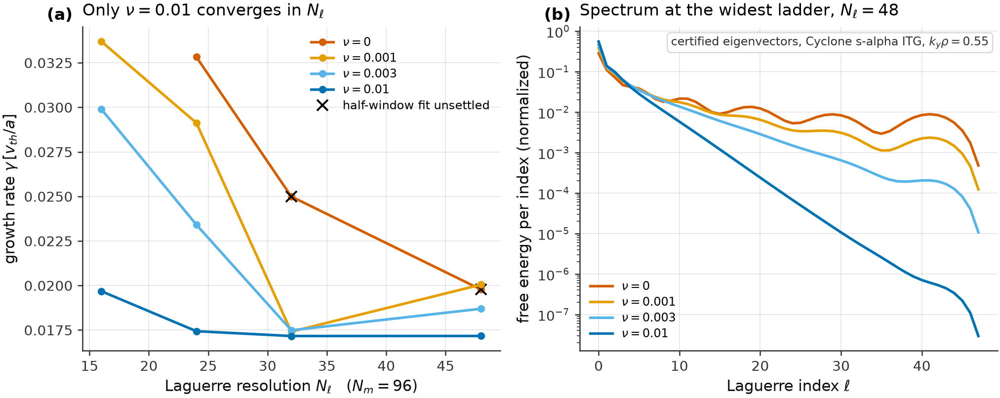
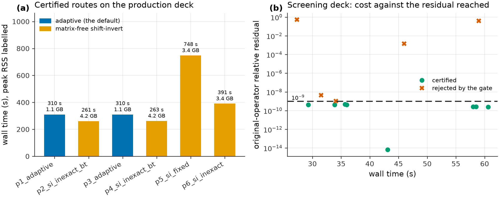
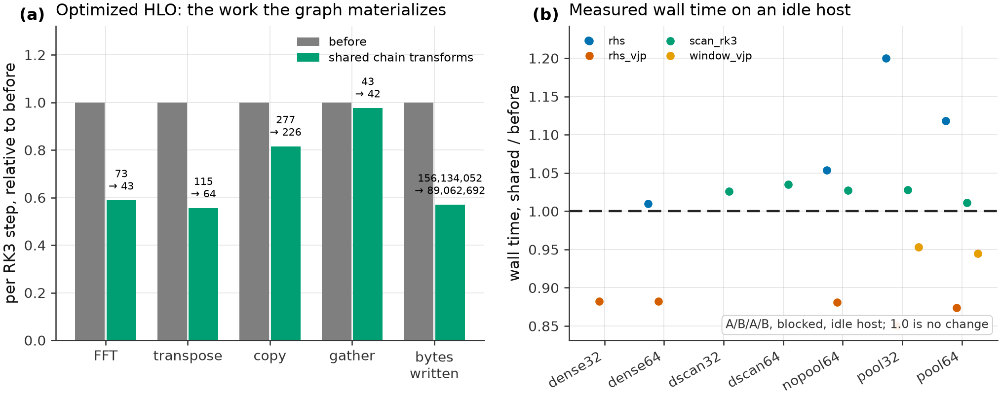
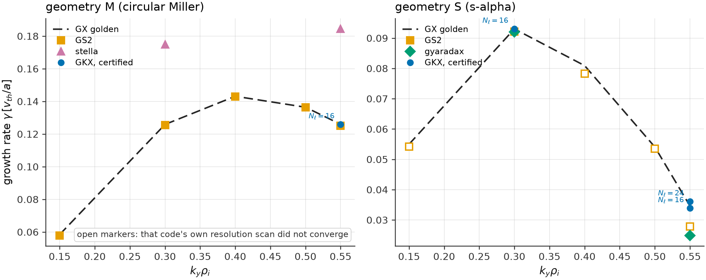

Methods and Decisions
=====================

What GKX does, why it does it that way, and what the evidence for each choice
does not cover. Each section states the decision first, then the measurement
behind it. Derivations are in :doc:`theory` and :doc:`linear_model`; the
term-by-term operator definitions are in :doc:`operators`; the numerical
contracts are in :doc:`numerics` and :doc:`solvers`.

Every figure on this page is regenerated from tracked evidence by the script
named in its caption, with no literal values in the script. Every number in the
text names the artifact or the ``plan/log.md`` row it comes from. Claim
boundaries are set by :doc:`release_scope`.

Summary of the decisions
------------------------

.. list-table::
   :header-rows: 1
   :widths: 26 40 34

   * - Decision
     - Why
     - What it is not
   * - Hermite--Laguerre velocity moments
     - velocity space becomes two spectral indices, so the whole problem is
       dense linear algebra on one array and differentiates in one pass
     - not a grid code; a truncated ladder has a reflecting end, which has to
       be absorbed rather than resolved
   * - Twist-and-shift linked chains
     - the parallel boundary of a sheared flux tube, solved on the modes the
       chains actually couple
     - the rows outside the chains are decoupled and undamped, so supplied
       states are projected, not trusted
   * - Certify every returned eigenpair
     - a Ritz pair with no convergence test can be the wrong branch at
       relative residual 0.98--1.00
     - certification is a residual gate, not a physics check: a certified
       pair of an under-resolved operator is still under-resolved
   * - Pseudo-spectral bracket, two-thirds rule
     - the nonlinearity is a convolution; the transform pair is the cheap way
       to evaluate it
     - dealiasing is exact for the quadratic term only
   * - One compiled graph per nonlinear route
     - two entry points that agree to roundoff are two answers
     - a bitwise identity gate, not a physics gate
   * - Hypercollisions by default
     - the Hermite recurrence time grows only as the square root of the
       truncation, so more moments is a weak fix
     - a declared regularization, reported as such; not a collisionless limit
   * - ``float32`` default, ``float64`` opt-in
     - the nonlinear step is data-movement bound
     - the eigen and conditioning paths need x64; some f32 graphs are not
       bit-reproducible run to run
   * - JAX end to end
     - one exact derivative of the whole path, including the equilibrium
     - reverse mode through an iteration is replaced by implicit rules, which
       is a different object with its own gates

Hermite--Laguerre velocity space
--------------------------------

The perturbed distribution of each species is expanded in normalized Hermite
functions of :math:`v_\parallel/v_{th}` and Laguerre polynomials of
:math:`\mu B/T`. The evolved state is one array,
``G[species, l, m, ky, kx, z]``, and every physical effect is a coupling on it:
parallel streaming is a ladder in :math:`m`, the magnetic mirror couples
:math:`m` and :math:`\ell`, the drifts multiply by
:math:`i(\mathbf{k}\cdot\mathbf{v}_d)`, and the gyroaverage is a function of
:math:`b = k_\perp^2\rho^2` acting in :math:`\ell`.

One right-hand side evaluation proceeds in a fixed order:

1. read :math:`b = k_\perp^2\rho^2` from the geometry;
2. evaluate the Laguerre gyroaverage coefficients :math:`J_\ell(b)`;
3. solve the field equations for :math:`\varphi`, :math:`A_\parallel`,
   :math:`B_\parallel`;
4. build the gyrokinetic variable :math:`H_{\ell m}` including the field
   couplings;
5. apply streaming, mirror, drift, drive, collision and damping terms to it.

Steps 1, 2 and the geometry-dependent parts of 5 are built once into a
``LinearCache`` outside the time loop. The sequence is written to be
JIT-compilable and differentiable as one graph; the term definitions are in
:doc:`operators`.

What this buys:

- Velocity space is two more spectral indices, not a separate grid with its own
  quadrature. The step is one fused kernel over a six-dimensional array.
- The same array is the state, the Krylov vector and the autodiff primal, so
  the eigensolver and the adjoint reuse the production operator instead of a
  reimplementation.
- Low moments are the fluid quantities, so a truncation at small :math:`(N_\ell,
  N_m)` is a closure rather than an unresolved grid.

What it costs is the subject of the next section.

Velocity-space truncation
-------------------------

Truncating the Hermite ladder at :math:`m = M` makes its end a reflecting wall.
Free energy returns as recurrence at :math:`t_{rec} \sim 2\sqrt{M}/(k_\parallel
v_{th})`, which grows only as :math:`\sqrt{M}`: adding moments buys time
sub-linearly, so the ladder has to absorb instead. Hypercollisions are the
default and cut the revival to 0.0009 at :math:`M = 16`. An opt-in
reflectionless closure (Kanekar et al., JPP **81**, 305810104 (2015)) needs no
tuning and does not beat a well-tuned hypercollision. Tables:
:doc:`numerics`.

The Laguerre direction is the one that has not closed. On the Cyclone s-alpha
ITG mode at :math:`k_y\rho = 0.55`, the collisionless growth rate is still
falling at :math:`N_\ell = 48`, and the eigenvector says why.

   **Laguerre truncation on the Cyclone s-alpha ITG mode,**
   :math:`k_y\rho = 0.55`, :math:`N_m = 96`, :math:`N_z = 96`. Panel (a) is the
   initial-value growth rate against :math:`N_\ell` at four collisionalities;
   crosses mark rungs whose half-window fit probe did not settle. Panel (b) is
   the normalized Laguerre free-energy spectrum of the certified eigenvector at
   :math:`N_\ell = 48`. Produced by ``scripts/artifacts/build_methods_figures.py
   velocity-truncation`` from
   ``plan/research/scripts/2026-09-13-collisional-convergence/summary.csv`` and
   ``plan/research/scripts/2026-09-18-eigen-laguerre-spectrum/results/``.
   One :math:`k_y`, one :math:`N_m`, one :math:`N_z`, one geometry. It does not
   establish a collisionless limit, and it is not a general resolution rule.

The numbers behind the figure:

.. list-table::
   :header-rows: 1
   :widths: 12 22 22 22 22

   * - :math:`\nu`
     - :math:`|\Delta\gamma|` over :math:`N_\ell`\ =32→48
     - interior maxima in the :math:`\ell` spectrum
     - last interior maximum, as a fraction of :math:`N_\ell`
     - decades from peak to cutoff
   * - 0
     - still falling at 64
     - 2, 3, 4 at :math:`N_\ell` 24/32/48
     - 0.79--0.85
     - 2.21--2.77
   * - 1e-3
     - 13.2%
     - 2--3
     - 0.79--0.85
     - 2.44--3.49
   * - 3e-3
     - 6.5%
     - 1
     - 0.79--0.85
     - 2.87--4.63
   * - 1e-2
     - 0.02%
     - none
     - --
     - 4.17--7.28

The ladders that have not converged carry a cutoff pile-up whose last local
maximum sits at 0.79--0.85 of :math:`N_\ell` at *every* rung, so raising
:math:`N_\ell` relocates it rather than resolving it. Only :math:`\nu = 10^{-2}`
has a monotone decaying spectrum, and it is the only ladder that converges. The
:math:`\varphi(z)` overlap is :math:`\ge 0.991` on all 30 eigenvector pairs, so
this is one slowly converging branch, not a branch change.

Two boundaries on that result. The converged pair,
:math:`\gamma = 0.0171695`, :math:`\omega = 0.495685` at :math:`N_\ell = 48`, is
collision-modified: :math:`\nu b \approx 0.13` at :math:`b_{max} = 12.7`, far
above :math:`\gamma`. It is not a collisionless limit. And the collisionless
reference rows at this :math:`k_y` are unconverged truncation values, not
converged growth rates. The working rule extracted from these runs -- a ladder
is converged once the spectrum has no interior maximum and the upper quarter
holds :math:`\lesssim 2\times 10^{-3}` of the free energy -- is a rule for this
deck, not a general tolerance. Evidence: ``plan/log.md``, rows Q8 and Q16;
plan section 0.5.

An independent implementation reproduces the collisional half of this. At
:math:`\nu = 10^{-2}` GX agrees with GKX to :math:`\le 5\times10^{-7}` relative
in :math:`\gamma` and :math:`\le 3.3\times10^{-6}` in :math:`\omega` at
:math:`N_\ell` 24 and 32, and takes the same :math:`-1.5602\%` step between
them. That is two codes integrating the same discrete collisional system, not a
physics validation of the value. The :math:`N_\ell = 48` rung was not run on GX,
so the plateau there is GKX's alone
(``plan/research/scripts/2026-09-14-gx-vnewk-control/summary.txt``).

Collisions
----------

Five operators ship, from a conserving diagonal Lenard-Bernstein/Dougherty
relaxation through drift-kinetic Sugama and improved Sugama to a drift-kinetic
linearized Coulomb and a gyrokinetic Coulomb retaining finite
:math:`k_\perp`. The models agree in the collisionless limit and separate as
collisionality rises. Every shipped matrix is checked against the published
closed forms: conservation and Onsager self-adjointness at 5.6e-17 and 8.3e-17
against a 5e-12 gate, published Appendix-C coefficients at 1.1e-16, and an
H-theorem maximum eigenvalue of 9.0e-18. Coulomb tables are generated for
like-species collisions; a multispecies request is refused rather than silently
extrapolated. Metrics:
``docs/_static/collision_operator_verification.json``. Equations, panels and the
parameter surface: :doc:`operators`.

Collisions are also the regularization lever of the previous section. Where a
scan is run collisionally to obtain a converged ladder, the collisionality is
part of the result and is reported with it.

Linked chains at the parallel boundary
--------------------------------------

A sheared flux tube closes through twist-and-shift: a :math:`(k_y, k_x)` mode at
one end of the domain maps to a different :math:`k_x` at the other, so the
parallel direction is periodic only along a *chain* of modes. GKX builds those
chains once, in the linear cache, and the eigen routes solve on the modes the
chains couple.

The decision and what it rests on:

- **Only the linked parallel derivative, its** :math:`k_z` **hypercollisions and
  the chain end damping couple** :math:`(k_y, k_x)` **modes,** and they act on
  chain members. A :math:`k_x` row outside the dealiased set therefore has no
  coupling to the chains in either direction and contributes only undamped drift
  eigenvalues next to a physical shift. On the :math:`N_x=8` linked Cyclone
  pilot that is 1536 of 4096 unknowns.
- **Seeds and every Krylov, power-iteration and inner GMRES vector are projected
  onto the chain modes.** Certification still applies the *unprojected*
  operator, so an unexpected coupling fails the residual gate instead of being
  hidden. On the pilot the projected sparse route returns the same eigenvalue to
  1.04e-16 relative, and the adaptive route returns a bitwise identical
  eigenvalue and eigenvector.
- **Supplied states are projected onto the chain cover, at intake.** The chains
  are closed under the whole right-hand side -- linear and nonlinear -- so a
  state that is zero outside them stays zero, and the time loop needs no
  per-step mask. Measured: 2000 RK4 steps leave the off-chain rows at exact
  zero.

That last rule is not cosmetic. Off-chain content is decoupled and undamped, so
no growth-rate fit and no certified eigenpair reads it, but the free energy and
the resolved spectra sum over every row: on the linear pilot a supplied state's
``Wg`` was inflated 114.9x by rows nothing else reads. On a nonlinear grid the
consequence is physical rather than diagnostic -- the bracket takes the
*unmasked* state into real space, so off-chain content aliases back onto the
chain rows and one right-hand side's chain rows move 2.37e-02 relative at
saturated amplitude. The effect is quadratic in amplitude, so a linear seed
shows almost nothing and a saturated restart shows all of it.

Below the runtime the same rule is a projection, never a rejection: those entry
points are traced, so an error condition would have to read values a tracer does
not have. The projection is a ``where`` against a mask fixed by the deck's
topology, so it holds under ``jit`` and reverse-mode AD, and the cotangent of a
supplied state is exactly zero off the chains and bitwise unchanged on them.
Periodic decks and full-cover linked grids get the same state object back and
trace exactly as before. Details and the entry-point list: :doc:`solvers`.

The measurements in this section are CPU, x64, on one linked linear pilot, one
linked nonlinear grid and one periodic grid, at 3--2000 step windows; no
production-size run was made. Evidence:
``plan/research/scripts/2026-09-14-covered-subspace/``,
``2026-09-18-off-chain-supplied-states/`` and
``2026-09-19-supplied-states-below-runtime/``.

Eigenpair certification
-----------------------

No route returns a pair above its original-operator relative residual

.. math::

   \frac{\lVert Av-\lambda v\rVert}
        {\max(\lVert Av\rVert,\,|\lambda|\,\lVert v\rVert)} .

``adaptive``, ``shift_invert`` and ``sparse_shift_invert`` raise when their own
gates reject a pair. ``power``, ``propagator`` and ``arnoldi`` have no
convergence test of their own, so their Rayleigh or Ritz pair is checked against
the same gate and a failing pair raises. ``certify=False`` is the explicit
opt-out for those three raw routes only; the pair is returned and reported as
uncertified, with its residual.

Why the raw routes fail closed rather than warn: on the linked Cyclone deck a
bare ``KrylovConfig()`` -- whose default used to be ``propagator`` -- returned
the wrong branch at relative residual 0.98--1.00. On an ETG deck the raw default
returned wrong branches at 0.982--0.990 on every row of a three-point scan. A
number that far from an eigenpair is not a tolerance question. A related defect
was fixed at the same time: an Arnoldi breakdown returning a zero vector scored
:math:`0/10^{-30} = 0` and "certified" on every gate, so a zero or non-finite
eigenvector now has infinite residual. Evidence:
``plan/research/scripts/2026-09-13-certify-eigenpair/``; contract and the API
change it forced: :doc:`solvers`.

The default is ``method="adaptive"``, the residual-certified route the runtime
already used. Results carry the evidence: ``RuntimeLinearResult.eigen_status``
records the residual, the gate applied, whether it passed, the route, and a
summary of the inner solves.

   **What a certified eigenpair costs.** Panel (a): six runs on the production
   chain (:math:`N_x`\ 1/:math:`N_y`\ 24/:math:`N_z`\ 96,
   :math:`N_\ell`\ 16/:math:`N_m`\ 48, :math:`n = 73728`), all certified, with
   peak resident memory labelled. Panel (b): the screening rung
   (:math:`n = 18432`), wall time against the residual each arm reached; colour
   is the recorded certification verdict, not the dashed line. Produced by
   ``scripts/artifacts/build_methods_figures.py eigen-cost`` from
   ``plan/research/scripts/2026-09-19-inner-solve-cost/summary.txt``. Single
   cold processes on a shared M3 Max whose load ran 1.8--12.8; the wall times
   are indicative, the operator-application counts behind them are not.
   It compares routes on one deck; it is not a scaling study.

The dense path is bounded by memory, not speed: at :math:`n = 494{,}592` a
complex128 operator alone would be 3.6 TiB. The matrix-free routes store a
Krylov basis instead, :math:`O(nm)`.

The current state of the shift-invert route is recorded rather than advertised.
Two tolerance-schedule and factorization levers make it 2.8x faster than the
configuration measured before them (443930 to 160254 matvec-equivalents, 748.2 s
to 261.0 s), which is the first configuration in which matrix-free shift-invert
beats the default at production size at all. It is still 1.15--1.22x fewer
matvec-equivalents than ``adaptive``, against an adoption gate of three times
fewer, so ``adaptive`` stays the default and no solver change followed. The
binding constraint is now the preconditioner apply: with a free apply the same
iteration count would be 27x under the gate. Full arm table: plan section 5.1.

The nonlinear bracket and dealiasing
------------------------------------

The :math:`E\times B` nonlinearity is a convolution in :math:`(k_x, k_y)`,
evaluated pseudo-spectrally: transform the two factors to real space, multiply,
transform back. Aliasing from the quadratic product is removed by the
two-thirds rule, so the retained set is
:math:`1 + 2\lfloor (N_x-1)/3 \rfloor` in :math:`k_x` and the corresponding
:math:`k_y` rows. That is exact for a quadratic term and for nothing else.

Two consequences are load-bearing elsewhere on this page. On a full nonlinear
grid the two-thirds mask and the linked-chain cover are the same set of rows,
which is why the free energy is not inflated by off-chain content there and the
bracket still is. And the perpendicular directions are Fourier while the
parallel direction follows the field line as a periodic FFT, so an open-ended
field line is a different model and is not admitted.

Hyperdiffusion and smooth field-aligned end damping are available and
independently disableable, so a resolution study can separate them from the
physics. Definitions: :doc:`numerics`.

Where the step's time goes, and a measurement that did not pay
--------------------------------------------------------------

The step is data-movement bound. On an Apple M3 Max (JAX CPU, float32) the
shipped default deck at 96x96x48 runs :math:`t_{max} = 200` in roughly 1.0--1.6
hours, about 97% of it time stepping, at about 196 ns per
:math:`N_x N_y N_z N_\ell N_m` element per step and flat from 64x64x24 to
96x96x48. Within a step about 60% is data movement and 39% the FFTs; the physics
arithmetic is not separately measurable because XLA fuses it into those kernels.

Optimization work is therefore gated on an op-and-byte ledger of the optimized
HLO *and* on a blocked A/B/A/B timing, because the two can disagree.

   **Sharing the linked-chain transforms: the ledger and the clock.** Panel (a)
   is the optimized-HLO count per RK3 step of the graph the runtime compiles,
   at 32x32x24, :math:`N_\ell`\ 2/:math:`N_m`\ 4, complex64, XLA:CPU, jax
   0.10.2, before and after the change. Panel (b) is the measured wall time of
   the same change, shared over before, from a blocked A/B/A/B campaign on an
   idle 12-core Xeon W-2295; the tags are the campaign's own arm names, where
   ``pool``/``nopool`` is the XLA CPU FFT thread pool, ``dense`` and ``dscan``
   are the high-repetition blocks, and the trailing number is the grid.
   Produced by ``scripts/artifacts/build_methods_figures.py chain-ledger`` from
   ``plan/research/scripts/2026-09-14-q9-batched-chain-fft/ledgers/`` and
   ``plan/research/scripts/2026-09-18-q9-idle-host-timing/ab_tables.txt``.
   Op counts are one optimized graph for one jax version and backend: they
   locate materialized work and are not a runtime claim. The timings are
   XLA:CPU on one host, complex64 only, one deck; nothing here transfers to a
   GPU.

The ledger improved and the clock did not. Sharing the per-class chain
transforms took the RK3 step from 73 FFT ops to 43 and from 115 transposes to
64, and cut materialized bytes 43--48% on every ledgered graph, with 100-step
trajectories bitwise identical in ``float32`` and under x64. On an idle host the adjoint path is 12% faster (0.88 pooled on the RHS
gradient at both grids, at or below 0.92 in 24 of 24 blocks) and the
checkpointed window gradient 5% faster at 64x64x24 -- but the RK3 scan, the
kernel closest to production throughput, is 2.6--3.5% *slower* pooled and slower
in 20 of the 24 blocks that timed it, and the standalone RHS is 22% slower at
32x32x24. The reading: the change halves launch counts but adds per-class stack
concatenates, and on an idle machine the launches it removed were cheap while
the extra data movement is not. Under contention the sign reverses, which is why
a loaded-host A/B is not evidence. Nothing was reverted on this measurement and
the forward-path cost is an open queue row.

One graph per nonlinear route
-----------------------------

There are two ways into an explicit nonlinear diagnostics run: ``gkx.prepare``,
which keeps a compiled scan, and the function entry point the runtime reaches on
its fixed-window, chunked and sharded routes. They are one reference route.
**Both compile the same jitted graph and return bitwise identical arrays for the
same inputs**, in ``float32`` and under x64, for value and for reverse-mode
gradient. Compare them with exact equality, not a tolerance.

The alternative was to declare a tolerance, and it was rejected on its own
numbers. Before the fix, none of twelve gate cases was bitwise in either
precision: final states differed by 8.0e-8 to 2.1e-7 relative in ``float32``,
zonal potential diagnostics reached 2.1e-6, growth-rate and frequency ratios
1.2e-3, and the turbulent-heating diagnostics -- a near-cancelling difference of
two larger terms -- reached 0.93 relative in ``float32`` and 1.41 under x64,
with no resolution or method dependence a tolerance could be derived from. A
tolerance contract would have had to say "compare the terms these are built from
instead", which is a worse contract than equality.

The price is paid in module literals, not in work: the runtime's RK3 graph loses
141 copies for +0.47% bytes written and gains 6.5 MB of captured arrays, and
peak resident memory over eight chunked calls *falls* from 1,200 MB to 826 MB
because one jit replaces roughly sixty small modules. No step does more work and
there is nothing to opt into. The one remaining difference is the state dtype: a
prepared object freezes the dtype it was built with, the function entry point
takes the dtype it is handed. That is a precision change, not a route
difference. Contract and cost table: :doc:`solvers`.

Precision
---------

``float32`` is the default and ``float64`` is opt-in through ``JAX_ENABLE_X64``
and ``GKX_X64``. The nonlinear step is data-movement bound, so the narrower
state is the faster one; the eigen, conditioning and Krylov-residual paths need
x64 and CI runs them there.

One measured caveat belongs next to that choice rather than in a footnote. The
``float32`` nonlinear RHS at 32x32x24 and 64x64x24 is **not bit-reproducible run
to run** under the multithreaded XLA:CPU FFT thunk: two runs of the same
unmodified source, minutes apart, differ by 1.4e-10 on the same key, while two
back-to-back runs of either tree agree bitwise. With
``--xla_cpu_multi_thread_eigen=false`` every pair is bitwise. Any ``float32``
bitwise gate on those graphs has to pin that flag, and the test suite does.
Disabling the pool is not free: on an idle host it costs 26--33% on the RHS and
8--10% per RK3 step, so the default stays on and the bitwise-stacking trade is
not taken. Evidence:
``plan/research/scripts/2026-09-18-q10-ky-layout-contract/`` and
``2026-09-18-q9-idle-host-timing/threadpool.txt``.

Differentiability
-----------------

The whole path differentiates, including the geometry, but not by
differentiating through an iteration.

- **Eigenvalues and eigenvector observables** use an implicit reverse rule,
  :math:`d\lambda/dp = w^{H}(dA/dp)v / (w^{H}v)` plus a bordered solve, applied
  to the production gyrokinetic right-hand side inside a restarted eigensolver.
  Storage is :math:`O(nm)`. Every candidate is certified against the original
  continuous operator before it is differentiated.
- **One production nonlinear objective** -- the physical heat flux averaged over
  a post-saturation RK window -- uses a block-checkpointed discrete adjoint
  storing :math:`O(\sqrt{N})` states. On a 16x16x16 Cyclone case over a
  1024-step window, checkpointing cuts measured temporary state from 7.82 GB to
  187 MB on CPU and 7.80 GB to 148 MB on an RTX A4000, for 1.92x and 1.77x more
  runtime. The exact discrete derivative and centered finite differences agree
  to 1e-11 through 512 steps and 2.7e-9 at 1024, inside the 1e-6 gate, and part
  at 2048 where chaotic trajectory separation sets the useful window length.
- **Supplied states** are projected onto the linked chain cover before they are
  differentiated, so the cotangent is exactly zero on rows that carry no physics
  forward.

What the derivatives are *for* is bounded separately. Quasilinear outputs rank,
correlate and screen; they are not a runtime absolute-flux predictor. The
nonlinear shape-optimization campaign is a scoped model-development result whose
promotion gates are open. See :doc:`differentiable_eigensolver`,
:doc:`nonlinear_autodiff`, :doc:`quasilinear` and :doc:`release_scope`.

Where GKX sits
--------------

GKX shares its Hermite--Laguerre gyro-moment velocity representation with GX,
which makes GX the closest algorithmic and parity reference. The capability
table is in :doc:`codes`; the parity numbers are in :doc:`benchmarks` and the
:doc:`verification_matrix`. This section records what has been *measured*
against other codes on one common case, which is less than a comparison.

   **One Cyclone case, four codes.** Growth rate against :math:`k_y\rho_i` on a
   circular Miller surface and on the s-alpha model, in GX units, against the
   GX goldens (dashed). Filled markers are values the code's own registered
   resolution ladder converged (:math:`<2\%` between two settled rungs); open
   markers are its last rung of an unconverged ladder. GKX points are certified
   eigenpairs at the single Laguerre resolution labelled, which is not a
   resolution ladder. Produced by ``scripts/artifacts/build_methods_figures.py
   cross-code`` from
   ``plan/research/scripts/2026-09-14-cross-code-cyclone/results/final_tables.txt``.
   The GX values are that code's shipped goldens at its own resolution, not
   converged values. This figure shows agreement and disagreement on one case;
   it is not a claim that any code here is more accurate or faster than
   another.

What the scan established, and what it did not:

- On the Miller surface GKX's certified pair at :math:`k_y\rho_i = 0.55` is
  within +0.65% in :math:`\gamma` and -1.4% in :math:`\omega` of the converged
  GS2 reference, which is itself within 0.6% of the GX golden.
- On the s-alpha model at :math:`k_y\rho_i = 0.30`, the one point where GS2
  converged, GKX is within -1.0% in :math:`\gamma` and +0.7% in :math:`\omega`;
  gyaradax's converged value is -1.1% from GKX.
- **stella disagrees with everything else on identical converged Miller input**,
  by 1.40--1.47x in :math:`\gamma` at the two :math:`k_y` where it was run. No
  single knob -- drift scaling, drive prefactor, Bessel factor -- moves it onto
  GS2's settled pair, and the geometry coefficients agree to about 1%. The cause
  is open. It is a stella-specific disagreement, not a setup difference, and
  nothing on this page depends on it.
- **No cross-code reference exists at s-alpha** :math:`k_y\rho_i = 0.55`. GS2's
  ladder does not converge there (its energy grid is the binding axis), only
  gyaradax converges, with a fixed numerical parallel dissipation, and GKX's
  certified :math:`N_\ell` 16 and 24 pairs are 36--45% above it. That
  :math:`k_y` is the same weakly growing mode whose Laguerre ladder is
  unconverged above.

Reading order
-------------

- :doc:`theory` and :doc:`linear_model` -- the equations.
- :doc:`operators` -- every term, its reference, and its verification gate.
- :doc:`numerics` -- discretization, the ``ky`` layout contract, closures,
  dealiasing, tuning.
- :doc:`solvers` -- time integration, the certification contract, state intake,
  the one-graph route.
- :doc:`geometry` and :doc:`normalization` -- equilibria and the benchmark
  contract.
- :doc:`performance` and :doc:`parallelization` -- profiles and what is and is
  not a promoted speedup.
- :doc:`release_scope` and :doc:`verification_matrix` -- the claim boundaries.
